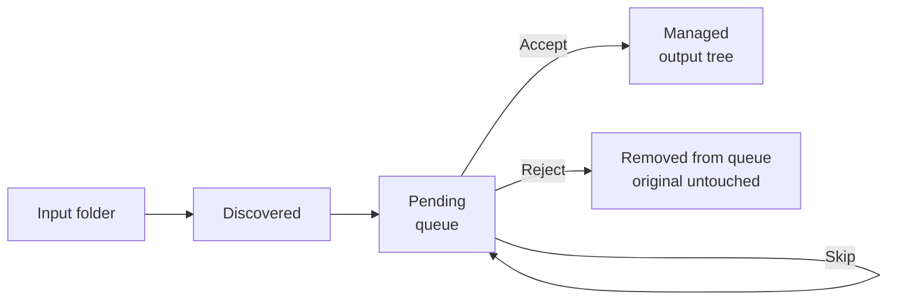
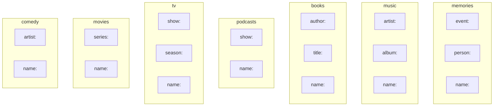
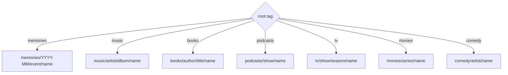
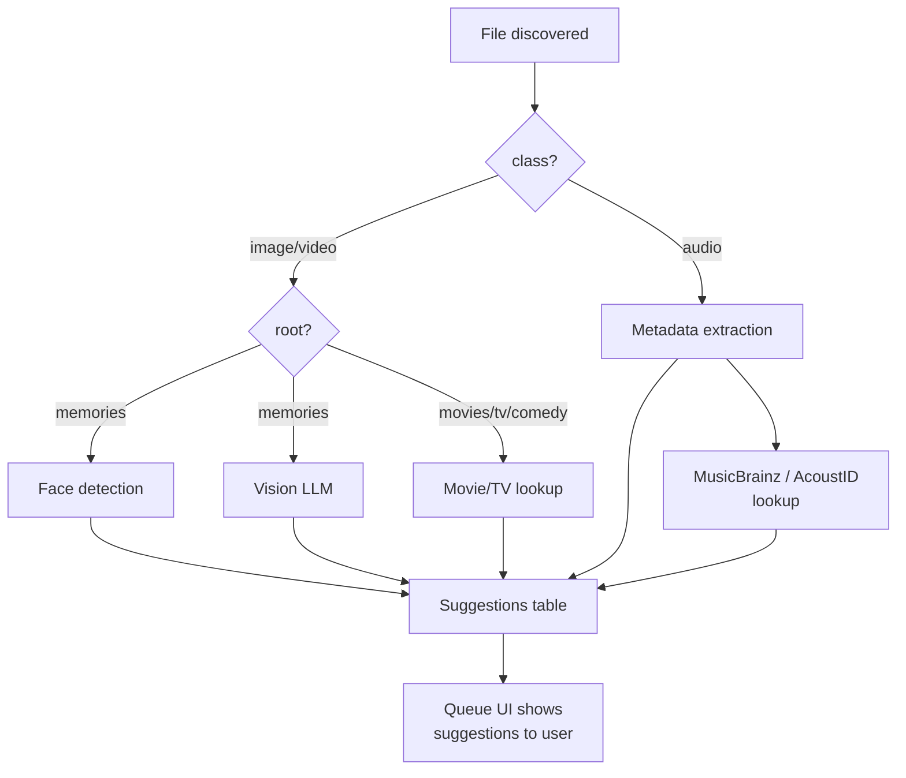

# SPEC.md — Pinpoint Requirements Specification

## Vision

Stop thinking about filenames and folder structures. Just tag your files and let Pinpoint figure out the rest.

Pinpoint is a local-first, tag-based file organization system. Point it at messy folders, review and tag files with AI assistance, and they land in a clean, predictable directory tree — derived entirely from their tags. No manual renaming, no dragging into folders, no deciding where things go.

Currently supports images, video, and audio. Designed to extend to any file type.

---

## 1. Core Mental Model

### Inputs and Output

- **Inputs**: one or more folders the system watches. Each input has a **default root tag** that determines how discovered files are organized. Files are never modified or moved until explicitly accepted.
- **Output**: a single root directory where accepted files are stored in a deterministic path derived from their tags.

### File Lifecycle



- **Pending**: file is known to the system, thumbnail generated, AI analysis queued. Original file stays where it is.
- **Managed**: file has been accepted and physically moved to the output tree. The system owns this file.

---

## 2. Tag Taxonomy

All tags follow a `type:value` structure. Some types support nesting via `:`.

### Universal tag types

#### `root:` — Top-level organizer

Determines the first directory segment and which other tags are path-relevant. Inherited from the input folder config, overridable per-file during review.

Values: `memories`, `music`, `books`, `podcasts`, `movies`, `tv`, `comedy`

#### `class:` — File type

Describes the format. Auto-assigned from file extension. Does not affect output path. Used for filtering and analysis pipeline selection. Supports nesting.

```
class:image
class:image:screenshot
class:video
class:video:timelapse
class:audio
class:audio:lossless
```

#### `name:` — Filename

Replaces the original filename in the output path (extension preserved). Used across all roots.

If two files share the same `name:` within the same directory scope, they auto-stack and get numeric suffixes (`-1`, `-2`, etc.).

#### `favorite`

Built-in tag. Also stored as a boolean column for fast sorting. Favorites always appear first in any listing.

#### General tags (no prefix)

Anything without a recognized prefix. For search and filtering only, no path effect.

```
landscape
funny
needs-editing
live-recording
```

### Root-specific tag types

Each root has its own set of meaningful tags. A tag type only appears in roots where it makes sense.



#### `event:` — Memories only

The occasion or context. Supports nesting via `:` — each segment becomes a directory.

```
event:hawaii-vacation
event:hawaii-vacation:snorkeling
event:birthday-party:cake-cutting
```

#### `person:` — Memories only

Who is in the photo or video. Maps to face recognition embeddings. A file can have multiple `person:` tags.

```
person:eva
person:max
person:grandma-rose
```

#### `artist:` — Music and Comedy

The performing artist or band.

```
artist:pink-floyd
artist:john-mulaney
```

#### `author:` — Books only

The book's author.

```
author:tolkien
author:ursula-k-le-guin
```

#### `album:` — Music only

The album name. **Prefixed with release year in brackets** for chronological sorting when browsing an artist's discography.

```
album:[1973] dark-side-of-the-moon
album:[1975] wish-you-were-here
album:[1979] the-wall
```

#### `title:` — Books only

The book title. Becomes a directory under the author.

```
title:the-hobbit
title:the-lord-of-the-rings
```

#### `show:` — TV and Podcasts

The series or show name. Becomes a directory.

```
show:the-office
show:hardcore-history
```

#### `season:` — TV only

Season identifier. Becomes a directory under the show.

```
season:3
season:s02
```

#### `series:` — Movies only

Groups related films (franchise, trilogy, etc.). Becomes a directory.

```
series:indiana-jones
series:lord-of-the-rings
series:marvel-cinematic-universe
```

### Tag dictionary

The system maintains a registry of all known tags.

- New tags are auto-registered on first use.
- Powers autocomplete in the queue UI.
- Tracks parent-child hierarchy for nested tags.
- Filtering by a parent includes all children (e.g. `event:hawaii-vacation` matches `:snorkeling` too).
- Browsable as a tree view grouped by type.

---

## 3. Output Path Structure

Each root has a fixed path formula. The path is deterministically derived from tags.



### `root:memories`

Photos and home video, colocated. Organized by date.

```
output/memories/<YYYY-MM>/<event:segments>/<n><ext>
```

| Tags | Output path |
|---|---|
| (none) | `memories/2025-01/IMG_4521.jpg` |
| `event:hawaii-vacation` | `memories/2025-01/hawaii-vacation/IMG_4521.jpg` |
| `event:hawaii-vacation:snorkeling` | `memories/2025-01/hawaii-vacation/snorkeling/IMG_4521.jpg` |
| `name:sunset-over-ocean` | `memories/2025-01/sunset-over-ocean.jpg` |
| `event:hawaii-vacation:snorkeling` + `name:sunset-over-ocean` | `memories/2025-01/hawaii-vacation/snorkeling/sunset-over-ocean.jpg` |

`YYYY-MM` is derived from the file's creation date. Images and videos from the same event sit side by side.

### `root:music`

Songs. Organized by artist. Albums include release year for chronological browsing.

```
output/music/<artist>/<album>/<n><ext>
```

| Tags | Output path |
|---|---|
| `artist:pink-floyd`, `album:[1973] dark-side-of-the-moon`, `name:time` | `music/pink-floyd/[1973] dark-side-of-the-moon/time.flac` |
| `artist:pink-floyd`, `name:another-brick` | `music/pink-floyd/another-brick.mp3` |
| `name:mystery-track` | `music/_unknown/mystery-track.mp3` |
| (none) | `music/_unknown/track-01.mp3` |

Browsing `music/pink-floyd/` in Finder gives you:
```
[1967] the-piper-at-the-gates-of-dawn/
[1973] dark-side-of-the-moon/
[1975] wish-you-were-here/
[1979] the-wall/
```

### `root:books`

Audiobooks. Organized by author.

```
output/books/<author>/<title>/<n><ext>
```

| Tags | Output path |
|---|---|
| `author:tolkien`, `title:the-hobbit`, `name:chapter-1` | `books/tolkien/the-hobbit/chapter-1.m4a` |
| `author:tolkien`, `title:the-hobbit` | `books/tolkien/the-hobbit/the-hobbit.m4a` *(original filename)* |
| `author:tolkien` | `books/tolkien/the-hobbit.m4a` *(original filename)* |

### `root:podcasts`

Podcast episodes. Organized by show.

```
output/podcasts/<show>/<n><ext>
```

| Tags | Output path |
|---|---|
| `show:hardcore-history`, `name:ep-66-supernova-in-the-east` | `podcasts/hardcore-history/ep-66-supernova-in-the-east.mp3` |
| `show:hardcore-history` | `podcasts/hardcore-history/episode.mp3` *(original filename)* |
| (none) | `podcasts/_unknown/episode.mp3` |

### `root:tv`

TV series episodes. Organized by show and season.

```
output/tv/<show>/<season>/<n><ext>
```

| Tags | Output path |
|---|---|
| `show:the-office`, `season:3`, `name:the-merger` | `tv/the-office/3/the-merger.mkv` |
| `show:the-office`, `season:3` | `tv/the-office/3/episode.mkv` *(original filename)* |
| `show:the-office` | `tv/the-office/episode.mkv` *(original filename)* |

### `root:movies`

Feature films. Optionally grouped by series/franchise.

```
output/movies/<series>/<n><ext>
```

| Tags | Output path |
|---|---|
| `name:the-dark-knight [2008]` | `movies/the-dark-knight [2008].mkv` |
| `series:indiana-jones`, `name:raiders-of-the-lost-ark [1981]` | `movies/indiana-jones/raiders-of-the-lost-ark [1981].mkv` |
| `series:lord-of-the-rings`, `name:the-fellowship-of-the-ring [2001]` | `movies/lord-of-the-rings/the-fellowship-of-the-ring [2001].mkv` |
| (none) | `movies/movie.mkv` *(original filename)* |

Year is part of the `name:` value, not a separate tag. `series:` is optional — standalone films sit flat in `movies/`. TMDb lookups auto-include the year in the suggestion, and can suggest `series:` from collection metadata.

### `root:comedy`

Standup specials and sketches. Organized by performer.

```
output/comedy/<artist>/<n><ext>
```

| Tags | Output path |
|---|---|
| `artist:john-mulaney`, `name:kid-gorgeous [2018]` | `comedy/john-mulaney/kid-gorgeous [2018].mp4` |
| `artist:john-mulaney` | `comedy/john-mulaney/special.mp4` *(original filename)* |

### General rules

- When `name:` is set, it replaces the filename. When absent, the original filename is kept.
- Missing path segments use `_unknown` as a placeholder.
- Duplicate names within the same directory scope auto-stack with numeric suffixes (`-1`, `-2`).
- When a stack dissolves to one file, the suffix is removed.
- Changing any path-affecting tag on a managed file triggers relocation. Empty parent directories are cleaned up.

---

## 4. Migration Queue

The queue is the primary workflow and the default landing page.

### Behavior

- Shows pending files **one at a time**, sorted **newest first**.
- Full-size preview (image viewer, video player, audio player).
- File metadata: filename, size, dimensions/duration, creation date, source path.
- **Live preview of the output path**, updating in real time as tags are added or changed.
- Queue count badge in the sidebar navigation.

### Queue modes

#### Single-file review (default for images/video)

One file at a time. Tag, preview path, accept/skip/reject.

#### Batch review (for audio, movies, TV, and bulk-tagged content)

Preview an entire folder or group at once. Useful when metadata APIs or filename parsing pre-fill most tags.

- Table/list view: filename, suggested tags, confidence.
- "Accept all" applies suggestions and accepts the batch.
- Individual rows editable or rejectable before batch accept.
- Click a row to open single-file detail.

### Tag entry in the queue

The root tag is shown at the top — inherited from the input folder, switchable via dropdown. Changing the root updates the available fields and the path preview.

Fields shown depend on the root:

| Root | Fields shown |
|---|---|
| `memories` | Event, Name, Person, Tags |
| `music` | Artist, Album (with year), Name (track), Tags |
| `books` | Author, Title, Name (chapter), Tags |
| `podcasts` | Show, Name (episode), Tags |
| `tv` | Show, Season, Name (episode), Tags |
| `movies` | Series (optional), Name (title [year]), Tags |
| `comedy` | Artist (performer), Name (title), Tags |

Each field has contextual labels and placeholder text appropriate to the root. The Album field for `root:music` shows placeholder "[1973] dark-side-of-the-moon" to prompt the year prefix convention. When audio API results include a release year, the suggestion pre-fills the `[year]` prefix automatically.

### Completeness nudge

Which tags are "expected" depends on the root:

| Root | Expected |
|---|---|
| `memories` | `event:` + `name:` |
| `music` | `artist:` + `album:` + `name:` |
| `books` | `author:` + `title:` + `name:` |
| `podcasts` | `show:` + `name:` |
| `tv` | `show:` + `season:` + `name:` |
| `movies` | `name:` |
| `comedy` | `artist:` + `name:` |

- Missing expected tags show an orange warning.
- Accept button dims to "Accept anyway…" with a confirmation explaining the fallback path.
- Field labels show "● expected" indicator until filled.

---

## 5. Deduplication & Stacking

### Exact duplicates

- Content hash at discovery. Duplicates never enter the queue.

### Perceptual similarity (images only)

- Perceptual hash at discovery. Files below a configurable hamming distance auto-stack.

### Name-collision stacking

- Files sharing a `name:` within the same directory scope auto-stack.
- Filenames get numeric suffixes: `beach-sunset-1.jpg`, `beach-sunset-2.jpg`.
- User can reorder z-order within the stack.

### Stack behavior

- Cover file shown in grid views, badge for stack depth.
- Manage: reorder, set cover, remove members, dissolve.
- Stack of one auto-dissolves (suffix removed).

---

## 6. AI Analysis Pipeline

All analysis runs locally. No cloud APIs except free/open music metadata lookup.



### Background worker

- Processes pending files in queue order (newest first).
- Should stay ahead of the user — when the queue is opened, the current file and nearby files are prioritized so suggestions are ready before the user sees them.
- Degrades gracefully: if any analysis tool is unavailable, skip it and move on.

### Image/video analysis

#### Face detection and recognition

- Detect faces in images. Optionally match against a directory of labeled reference photos (filename = person label).
- Detected faces become `person:` tag suggestions with bounding box regions.
- Unknown faces prompt the user to assign a label during review, which is stored for future recognition.

#### Vision LLM

- Send images to a local vision model for scene description.
- Model suggests event, name, and general tags.
- Images should be downscaled before sending to keep inference fast on CPU.
- Silently skipped if no vision model is available.

### Audio analysis

#### Metadata extraction

- Read embedded tags (ID3, Vorbis, MP4 atoms, etc.).
- Extract: title, artist, album, year, genre, track number, album art.

#### Free API lookup

- **MusicBrainz**: lookup by artist+title for canonical metadata.
- **AcoustID/Chromaprint**: audio fingerprinting to identify unknown tracks.
- Results mapped to tag suggestions based on the file's root:

| Source | `root:music` | `root:books` | `root:podcasts` |
|---|---|---|---|
| Artist/Author | `artist:` | `author:` | — |
| Album/Title | `album:[year] name` | `title:` | `show:` |
| Track/Chapter | `name:` | `name:` | `name:` |
| Genre | — | — | — |

### Movie/TV analysis

For files in `root:movies`, `root:tv`, and `root:comedy` — attempt to identify the content from the original filename (which often contains the title, year, season/episode numbers, or release group tags).

#### Filename parsing

- Extract likely title, year, season/episode numbers from common naming patterns (e.g. `The.Office.S03E05.720p.mkv`, `There Will Be Blood (2007).mp4`, `John.Mulaney.Kid.Gorgeous.2018.WEBRip.mp4`).

#### Free API lookup

- **TMDb (The Movie Database)**: free API, search by title+year for movies and TV. Returns canonical title, year, overview, genres, cast.
- **TVDb** or **TMDb TV endpoints**: lookup by show+season+episode for episode titles.
- Results mapped to tag suggestions:

| Source | `root:movies` | `root:tv` | `root:comedy` |
|---|---|---|---|
| Title + Year | `name:title [year]` | `show:` | `name:title [year]` |
| Collection/Franchise | `series:` | — | — |
| Episode title | — | `name:` | — |
| Season/Episode | — | `season:` | — |
| Performer/Director | — | — | `artist:` |

### Suggestions

- AI results are stored as suggestions with a confidence score.
- Displayed in the queue UI as provisional tags the user can accept or dismiss.
- Unknown faces → "Who is this?" prompt → creates `person:` tag + stores reference for future recognition.
- Queue UI shows analysis status and updates as suggestions arrive.

---

## 7. Search and Browsing

### Library view

- Shows managed files. Grid of thumbnails/icons.
- Favorites sort first.

### Filters

- Date range.
- Root.
- Class.
- Person / Artist / Author (context-appropriate for root).
- Tags — multiple = AND. Parent tags include children.
- Full-text search across filenames, tags, metadata, AI descriptions.

### On This Day

- Files from date-based roots (`memories`) matching today's month+day across all years.
- Grouped by year. Favorites first.

### Tag dictionary browser

- Tree view of all tags, grouped by type.
- Usage counts. Click to filter library.
- Expandable hierarchy.

---

## 8. Favorites

- Built-in tag + boolean column for fast sorting.
- Star toggle on cards and detail views.
- Always sort first. Dedicated sidebar view.

---

## 9. File Detail View

- Full-size preview (image/video/audio) in overlay.
- Sidebar: favorite toggle, metadata, all tags (editable), face regions for `person:` tags.
- Managed files: delete removes from disk + cleans empty parents.
- Pending files: reject removes from queue only.

---

## 10. Data Schema

### Core tables

- **files** — every known file: id, source path, managed path, status (pending/managed/missing/drifted), root, class, content hash, perceptual hash, creation date, discovery date, managed date, favorite flag, stack membership, analysis status.
- **tags** — tag dictionary: id, full name (e.g. `event:hawaii-vacation:snorkeling`), type (root/class/event/name/person/artist/author/album/title/show/season/series/general), builtin flag.
- **file_tags** — join: file id, tag id, region (face bounding box if applicable), timestamp.
- **suggestions** — AI results: file id, kind, value, confidence, region, status (pending/accepted/dismissed), timestamp.
- **stacks** — similarity/dedup groups: id, cover file, creation date.
- **known_faces** — labeled face embeddings: id, label, embedding, source file, creation date.
- **full-text search index** — across filenames, tag names, metadata, AI descriptions.

### Action log

- **actions** — append-only audit trail of every state-changing operation.
  - timestamp
  - action verb: `discover`, `accept`, `reject`, `delete`, `tag_add`, `tag_remove`, `favorite`, `unfavorite`, `relocate`, `rename`, `move`, `missing`, `stack_create`, `stack_reorder`, `stack_dissolve`, `suggestion_accept`, `suggestion_dismiss`
  - file id (nullable for system-level actions)
  - detail payload — action-specific context, e.g.:
    - `accept`: source path, destination path
    - `relocate`: old path, new path, which tag change triggered it
    - `tag_add`: tag name, region if applicable
    - `delete`: path, whether file was managed
    - `discover`: source path, content hash
    - `rename`: old path, new path (external change)
    - `move`: old path, new path (external change)
    - `missing`: expected path

Not used for undo — just a queryable log for debugging and manual error recovery.

---

## 11. Output Monitoring

The output directory is a regular folder. Users may interact with it directly via Finder, terminal, or other tools. Pinpoint watches the output tree and responds to external changes.

### File renamed

- Detect via filesystem watcher (file at known `managed_path` disappears, new file appears in same directory with same size/hash).
- Update `managed_path` in the database.
- Log a `rename` action with old and new paths.
- **Do not** reverse-derive tags from the new filename. The rename is accepted as-is — tags remain the source of truth. The file is now "drifted" from its tag-derived path.
- Optionally surface drifted files in the UI so the user can reconcile (re-tag to match, or trigger a relocate to snap back).

### File moved

- Detect via watcher (file disappears from known path, same hash appears elsewhere in output tree).
- Update `managed_path`.
- Log a `move` action with old and new paths.
- Same drift handling as rename — tags don't change, file is marked as drifted.

### File deleted externally

- Detect via watcher (file at known `managed_path` no longer exists, no matching hash found elsewhere).
- Mark file as `missing` in the database (not deleted from DB — preserve the metadata and action history).
- Log a `missing` action.
- Surface in the UI so the user can acknowledge (remove from DB) or investigate.

### New file added to output

- Detect via watcher (unknown file appears in output tree).
- Treat it like a discovery from an input folder: hash it, check for duplicates, add to the pending queue.
- Attempt to reverse-derive tags from the path (e.g. a file at `music/pink-floyd/[1973] dark-side-of-the-moon/time.flac` → suggest `root:music`, `artist:pink-floyd`, `album:[1973] dark-side-of-the-moon`, `name:time`).
- Since the file is already in the output tree, accepting it just registers it as managed in-place (no move needed).

### Periodic verification

- On startup (and optionally on a schedule), scan all managed files and verify they exist at their expected paths.
- Surface any missing or drifted files.

## 12. Filesystem Metadata (macOS)

- When available, write tags to extended attributes on managed files.
- On discovery, import existing tags from extended attributes and macOS Finder tags.
- Optional — works without on other platforms.

---

## 13. Configuration

Minimal. Inputs with their default root, and an output path.

```yaml
inputs:
  - path: ~/Pictures
    root: memories
  - path: ~/DCIM
    root: memories
  - path: ~/Music
    root: music
  - path: ~/Audiobooks
    root: books
  - path: ~/Downloads/podcasts
    root: podcasts
  - path: ~/Movies
    root: movies

output: ~/.pinpoint/files
```

Everything else has sensible defaults in code. Hot-reloads on file change.

---

## 14. Out of Scope (for now)

- Multi-user / authentication.
- Remote/cloud storage backends.
- Mobile-optimized UI (basic responsive only).
- Undo/history UI (action log exists for manual recovery, but no automated undo).
- Lyrics / subtitle handling.
- Music videos root (add when needed).
- Custom root definitions (extend when needed).
- Symlink libraries.
