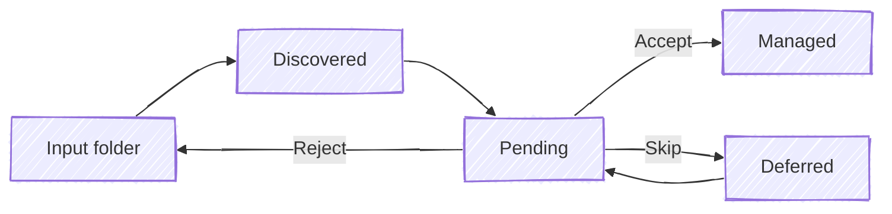
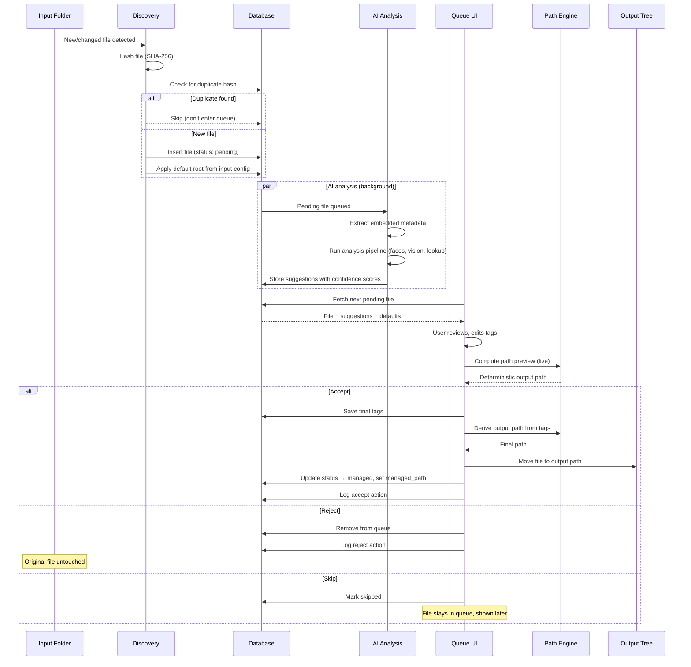
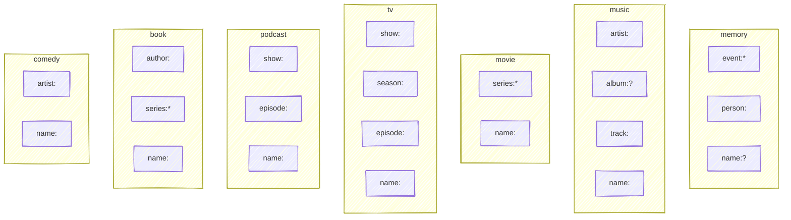
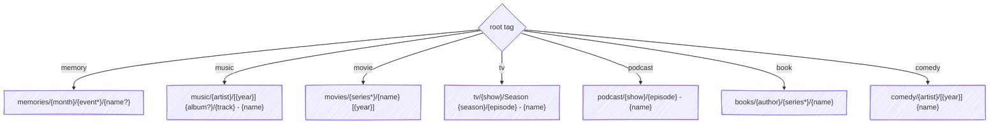
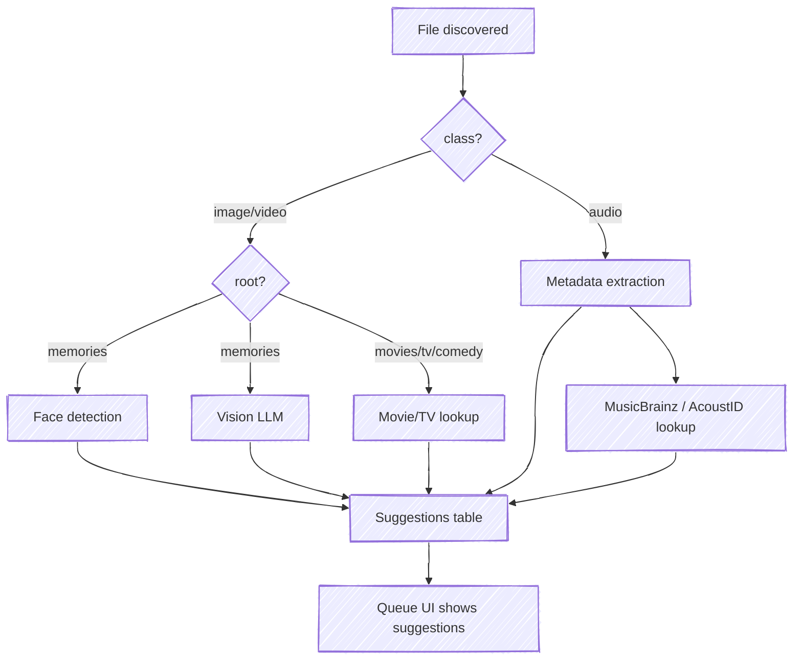

# SPEC.md — Pinpoint Requirements Specification

## Requirements Notation

Each testable requirement has a stable ID in brackets: `[XX-N]`. Code and DECISIONS.md reference these IDs for traceability.

| Prefix | Section |
|--------|---------|
| CM | Core Model (§1) |
| TX | Tag Taxonomy (§2) |
| OP | Output Path (§3) |
| MQ | Migration Queue (§4) |
| DS | Dedup & Stacking (§5) |
| AI | AI Analysis (§6) |
| LB | Library & Browse (§7) |
| FV | Favorites (§8) |
| FD | File Detail (§9) |
| DM | Data Model (§10) |
| OM | Output Monitoring (§11) |
| XA | Extended Attributes (§12) |
| CF | Configuration (§13) |

---

## Vision

Stop thinking about filenames and folder structures. Just tag your files and let Pinpoint figure out the rest.

Pinpoint is a local-first, tag-based file organization system. Point it at messy folders, review and tag files with AI assistance, and they land in a clean, predictable directory tree — derived entirely from their tags. No manual renaming, no dragging into folders, no deciding where things go.

Currently supports images, video, and audio. Designed to extend to any file type.

---

## 1. Core Mental Model

### Inputs and Output

- **[CM-1]** **Inputs**: one or more folders the system watches. Each input has a **default root tag** that determines how discovered files are organized. Files are never modified or moved until explicitly accepted.
- **[CM-2]** **Output**: a single root directory where accepted files are stored in a deterministic path derived from their tags.

### File Lifecycle



- **[CM-3]** **Pending**: file is known to the system, thumbnail generated (for queue and library previews; video thumbnails use an early frame), AI analysis queued. Original file stays where it is.
- **[CM-4]** **Managed**: file has been accepted, tags are written into the file's native metadata, and the file is physically moved to the output tree. The system owns this file.
- **[CM-5]** **Files are the source of truth.** Tags are persisted in each file's native metadata format (EXIF/IPTC/XMP for images, ID3 for MP3, Vorbis comments for FLAC, etc.). The database is a cache — fully rebuildable by scanning managed files and reading their embedded tags. See §12.

### Discovery to managed — detailed flow



---

## 2. Tag Taxonomy

All tags follow a `type:value` structure. Some types support nesting via `:`.

### Universal tag types

#### `root:` — Top-level organizer

Determines the first directory segment and which other tags are path-relevant. Inherited from the input folder config, overridable per-file during review.

Values: `memory`, `music`, `book`, `podcast`, `movie`, `tv`, `comedy`

#### `date:` — Temporal metadata

Every root has a `date` tag (YYYY-MM-DD). Derived from the best available source: embedded media metadata (EXIF, QuickTime, ID3) over filesystem dates. If no date can be determined, use the discovery date.

#### `favorite`

Built-in tag. Also stored as a boolean column for fast sorting. Favorites always appear first in any listing.

#### General tags (no prefix)

Anything without a recognized prefix. For search and filtering only, no path effect.

```
landscape
funny
needs-editing
live-recording
```

### Derived attributes (not tags)

These are computed from file properties and never stored as tags or written to file metadata:

- **`class`** — file type (image, video, audio, document). Derived from file extension. Used for filtering, preview rendering, and AI pipeline selection.
- **`month`** — `YYYY-MM`, derived from `date`. Used in `memory` path formula.
- **`year`** — `YYYY`, derived from `date`. Used in `music`, `movie`, and `comedy` path formulas.

### Root-specific tag types

Each root defines which tags are path-relevant. The schema below shows every root's tags and output path template (see §3 for full rules).



#### `name:` — Filename (all roots)

Replaces the original filename in the output path (extension preserved). When absent, the original filename is kept.

If two files share the same `name:` within the same directory scope, they auto-stack and get numeric suffixes "\-1", "\-2", which corresponds to the z-order in the stack. When a stack dissolves to one file, the suffix is removed.

#### `event:` — Memory only

The occasion or context. Supports nesting via `:` — each segment becomes a directory.

```
event:Hawaii Vacation
event:Hawaii Vacation:Snorkeling
event:Birthday Party:Cake Cutting
```

#### `person:` — Memory only

Who is in the photo or video. Maps to face recognition embeddings. A file can have multiple `person:` tags. Not path-relevant.

```
person:Eva
person:Max
person:Grandma Rose
```

#### `artist:` — Music and Comedy

The performing artist or band.

```
artist:Pink Floyd
artist:John Mulaney
```

#### `album:` — Music only

The album name. The `[year]` prefix in the output path is derived from the `year` tag — users enter the album name without a year.

```
album:Dark Side of the Moon
album:Wish You Were Here
album:The Wall
```

#### `track:` — Music only

Track number, zero-padded (minimum 2 digits). Extracted from embedded metadata. Becomes part of the output filename.

```
track:01
track:12
```

#### `author:` — Book only

The book's author.

```
author:Tolkien
author:Ursula K Le Guin
```

#### `series:` — Movie and Book

Groups related works. Supports nesting. Optional — standalone works sit flat without a series directory.

```
series:Indiana Jones
series:Lord of the Rings
series:Harry Potter:Hogwarts Library
```

#### `show:` — TV and Podcast

The series or show name. Becomes a directory.

```
show:The Office
show:Hardcore History
```

#### `season:` — TV only

Season number, zero-padded. Becomes a directory under the show as `Season ##`.

```
season:01
season:03
```

#### `episode:` — TV and Podcast

Episode number, zero-padded. Becomes part of the output filename.

```
episode:01
episode:05
```

### Tag dictionary

The system maintains a registry of all known tags.

- New tags are auto-registered on first use.
- Powers autocomplete in the queue UI.
- Tracks parent-child hierarchy for nested tags.
- Filtering by a parent includes all children (e.g. `event:Hawaii Vacation` matches `:Snorkeling` too).
- Browsable as a tree view grouped by type.

---

## 3. Output Path Structure

- **[OP-1]** Each root has a fixed path formula. The path is deterministically derived from tags. Path templates use the syntax described in §13.



### `root:memory`

Photos and home video, colocated. Organized by date and event.

```
memories/{tag:month}/{tag:event*}/{tag:name?}<ext>
```

| Tags | Output path |
|---|---|
| (none) | `memories/2025-01/IMG_4521.jpg` |
| `event:Hawaii Vacation` | `memories/2025-01/Hawaii Vacation/IMG_4521.jpg` |
| `event:Hawaii Vacation:Snorkeling` | `memories/2025-01/Hawaii Vacation/Snorkeling/IMG_4521.jpg` |
| `name:Sunset Over Ocean` | `memories/2025-01/Sunset Over Ocean.jpg` |
| `event:Hawaii Vacation:Snorkeling`, `name:Sunset Over Ocean` | `memories/2025-01/Hawaii Vacation/Snorkeling/Sunset Over Ocean.jpg` |

- **[OP-2]** `month` (YYYY-MM) is derived from `date`, which is determined from the best available source: embedded media metadata (EXIF, QuickTime) over filesystem dates. If no date can be determined, use the discovery date. Images and videos from the same event sit side by side.

### `root:music`

Songs. Organized by artist. Albums include release year for chronological browsing.

```
music/{tag:artist}/[{tag:year}] {tag:album?}/{tag:track} - {tag:name}<ext>
```

- **[OP-3]** `track` is zero-padded (minimum 2 digits) for ordinal sorting. Extracted from embedded metadata. When no track number is available, the filename is the name alone (no "\-" separator).
- **[OP-4]** For Various Artists compilations (albumartist = "Various Artists"), the artist is "Various Artists" and the original filename is preserved as-is (it typically encodes `## - Artist - Track` which is more informative than just the title).

| Tags | Output path |
|---|---|
| `artist:Pink Floyd`, `album:Dark Side of the Moon`, `year:1973`, `track:01`, `name:Time` | `music/Pink Floyd/[1973] Dark Side of the Moon/01 - Time.flac` |
| `artist:Pink Floyd`, `name:Another Brick` | `music/Pink Floyd/Another Brick.mp3` |
| `artist:Various Artists`, `album:8 Mile Soundtrack`, `year:2002` | `music/Various Artists/[2002] 8 Mile Soundtrack/15 - Gang Starr - Battle.mp3` *(original filename)* |
| `name:Mystery Track` | `music/_unknown/Mystery Track.mp3` |
| (none) | `music/_unknown/track-01.mp3` *(original filename)* |

Browsing `music/Pink Floyd/` in Finder gives you:
```
[1967] The Piper at the Gates of Dawn/
[1973] Dark Side of the Moon/
[1975] Wish You Were Here/
[1979] The Wall/
```

### `root:movie`

Feature films. Optionally grouped by series/franchise. Year appended for disambiguation.

```
movies/{tag:series*}/{tag:name} [{tag:year}]<ext>
```

| Tags | Output path |
|---|---|
| `name:The Dark Knight`, `year:2008` | `movies/The Dark Knight [2008].mkv` |
| `series:Indiana Jones`, `name:Raiders of the Lost Ark`, `year:1981` | `movies/Indiana Jones/Raiders of the Lost Ark [1981].mkv` |
| `series:Lord of the Rings`, `name:The Fellowship of the Ring`, `year:2001` | `movies/Lord of the Rings/The Fellowship of the Ring [2001].mkv` |
| (none) | `movies/movie.mkv` *(original filename)* |

`series:` is optional — standalone films sit flat in `movies/`. `series:` supports nesting for sub-franchises. TMDb lookups suggest `name`, `year`, and `series` from collection metadata.

### `root:tv`

TV series episodes. Organized by show and season.

```
tv/{tag:show}/Season {tag:season}/{tag:episode} - {tag:name}<ext>
```

| Tags | Output path |
|---|---|
| `show:The Office`, `season:03`, `episode:05`, `name:The Merger` | `tv/The Office/Season 03/05 - The Merger.mkv` |
| `show:The Office`, `season:03`, `episode:05` | `tv/The Office/Season 03/05.mkv` *(original filename)* |
| `show:The Office` | `tv/The Office/episode.mkv` *(original filename)* |

### `root:podcast`

Podcast episodes. Organized by show.

```
podcast/{tag:show}/{tag:episode} - {tag:name}<ext>
```

| Tags | Output path |
|---|---|
| `show:Hardcore History`, `episode:66`, `name:Supernova in the East` | `podcast/Hardcore History/66 - Supernova in the East.mp3` |
| `show:Hardcore History` | `podcast/Hardcore History/episode.mp3` *(original filename)* |
| (none) | `podcast/_unknown/episode.mp3` *(original filename)* |

### `root:book`

Audiobooks. Organized by author, optionally grouped by series.

```
books/{tag:author}/{tag:series*}/{tag:name}<ext>
```

| Tags | Output path |
|---|---|
| `author:Tolkien`, `name:The Hobbit` | `books/Tolkien/The Hobbit.m4a` |
| `author:Tolkien`, `series:Middle Earth`, `name:The Hobbit` | `books/Tolkien/Middle Earth/The Hobbit.m4a` |
| `author:Ursula K Le Guin`, `series:Earthsea`, `name:A Wizard of Earthsea` | `books/Ursula K Le Guin/Earthsea/A Wizard of Earthsea.m4a` |
| (none) | `books/_unknown/book.m4a` *(original filename)* |

### `root:comedy`

Standup specials and sketches. Organized by performer. Year prepended for chronological sorting.

```
comedy/{tag:artist}/[{tag:year}] {tag:name}<ext>
```

| Tags | Output path |
|---|---|
| `artist:John Mulaney`, `name:Kid Gorgeous`, `year:2018` | `comedy/John Mulaney/[2018] Kid Gorgeous.mp4` |
| `artist:John Mulaney` | `comedy/John Mulaney/special.mp4` *(original filename)* |

### Tag value casing

- **[OP-5]** Tag values use **Title Case** with spaces as word separators. Minor words (a, an, the, and, or, of, in, on, etc.) stay lowercase unless first or last.

```
artist:Pink Floyd
album:Dark Side of the Moon
name:The Dark Knight
event:Hawaii Vacation:Snorkeling
author:Ursula K Le Guin
```

Defaults derived from embedded metadata or folder structure are automatically converted to this convention.

### Year is metadata, not part of name/album

- **[OP-6]** The `[year]` in output paths (e.g., `[1973] Dark Side of the Moon`, `The Dark Knight [2008]`) is derived automatically from the `year` tag. Users enter the name/album without a year — the year is a separate tag. This keeps names clean in the UI while producing chronologically sortable output paths.

### General rules

- **[OP-7]** When `name:` is set, it replaces the filename. When absent, the original filename is kept.
- **[OP-8]** Missing required path segments use `_unknown` as a placeholder.
- **[OP-9]** Duplicate filenames within the same directory scope auto-stack with numeric suffixes ("\-1", "\-2", etc.).
- **[OP-10]** When a stack dissolves to one file, the suffix is removed.
- **[OP-11]** Changing any path-affecting tag on a managed file triggers relocation. Empty parent directories are cleaned up.

---

## 4. Migration Queue

The queue is the primary workflow for ingesting new files. Accessible via sidebar navigation.

### Behavior

- **[MQ-1]** Shows pending files **one at a time**, sorted **newest first**.
- **[MQ-2]** Full-size preview (image viewer, video player, audio player).
- **[MQ-3]** File metadata: filename, size, dimensions/duration, creation date, source path.
- **[MQ-4]** **Live preview of the output path**, updating in real time as tags are added or changed.
- **[MQ-5]** Queue count badge in the sidebar navigation.

### Queue modes

#### Single-file review (default for images/video)

One file at a time. Tag, preview path, accept/skip/reject.

#### Batch review (for audio, movies, TV, and bulk-tagged content)

Preview an entire folder or group at once. Useful when metadata APIs or filename parsing pre-fill most tags.

- **[MQ-6]** Table/list view: filename, suggested tags, confidence.
- **[MQ-7]** "Accept all" applies defaults and accepts the batch. Available when all files in the current source folder have stable embedded metadata (artist, album, year, and track title all present). Shown as a button in the single-file queue view when applicable.
- **[MQ-8]** Individual rows editable or rejectable before batch accept.
- **[MQ-9]** Click a row to open single-file detail.

### Tag entry in the queue

The root tag is shown at the top — inherited from the input folder, switchable via dropdown. Changing the root updates the available fields and the path preview.

Fields shown depend on the root:

| Root | Fields shown |
|---|---|
| `memory` | Event, Name, Person, Tags |
| `music` | Artist, Album, Year, Track, Name, Tags |
| `movie` | Series (optional), Title, Year, Tags |
| `tv` | Show, Season, Episode, Name, Tags |
| `podcast` | Show, Episode, Name, Tags |
| `book` | Author, Series (optional), Title, Tags |
| `comedy` | Artist, Title, Year, Tags |

Each field has contextual labels and placeholder text appropriate to the root. Year fields are auto-populated from embedded metadata when available.

### Completeness nudge

Which tags are "expected" depends on the root:

| Root | Expected |
|---|---|
| `memory` | `event:` + `name:` |
| `music` | `artist:` + `album:` + `name:` |
| `movie` | `name:` |
| `tv` | `show:` + `season:` + `episode:` + `name:` |
| `podcast` | `show:` + `episode:` + `name:` |
| `book` | `author:` + `name:` |
| `comedy` | `artist:` + `name:` |

- Missing expected tags show an orange warning.
- Accept button dims to "Accept anyway…" with a confirmation explaining the fallback path.
- Field labels show "● expected" indicator until filled.

---

## 5. Deduplication & Stacking

### Exact duplicates

- **[DS-1]** Content hash at discovery. Duplicates never enter the queue.

### Perceptual similarity (images only)

- **[DS-2]** Perceptual hash at discovery. Files below a configurable hamming distance auto-stack.

### Name-collision stacking

- Files sharing a `name:` within the same directory scope auto-stack.
- Filenames get numeric suffixes: `beach-sunset-1.jpg`, `beach-sunset-2.jpg`.
- User can reorder z-order within the stack.

### Stack behavior

- Cover file shown in grid views, badge for stack depth.
- Manage: reorder, set cover, remove members, dissolve.
- Stack of one auto-dissolves (suffix removed).

---

## 6. AI Analysis Pipeline

All analysis runs locally. No cloud APIs except free/open music metadata lookup.



### Background worker

- Processes pending files in queue order (newest first).
- Should stay ahead of the user — when the queue is opened, the current file and nearby files are prioritized so suggestions are ready before the user sees them.
- Degrades gracefully: if any analysis tool is unavailable, skip it and move on.

### Image/video analysis

#### Face detection and recognition

- Detect faces in images using a local face detection library. Optionally match against a directory of labeled reference photos (filename = person label).
- Detected faces become `person:` tag suggestions with bounding box regions.
- Unknown faces prompt the user to assign a label during review, which is stored for future recognition.
- Silently skipped if no face detection library is available.

#### Scene description

- Send images to a local vision model for scene description.
- Model suggests event, name, and general tags.
- Images should be downscaled before sending to keep inference fast on CPU.
- Silently skipped if no vision model is available.

### Audio analysis

#### Metadata extraction

- **[AI-1]** Read embedded tags (ID3, Vorbis, MP4 atoms, etc.).
- **[AI-2]** Extract: title, artist, album, year, genre, track number, album art.
- **[AI-3]** Images in directories that contain audio files (cover art, booklet scans) are auto-skipped during discovery.

#### Free API lookup

- **MusicBrainz**: lookup by artist+title for canonical metadata.
- **AcoustID**: audio fingerprinting to identify unknown tracks.
- Results mapped to tag suggestions based on the file's root:

| Source | `root:music` | `root:book` | `root:podcast` |
|---|---|---|---|
| Artist/Author | `artist:` | `author:` | — |
| Album/Title | `album:` | `name:` | `show:` |
| Year | `year:` | — | — |
| Track/Chapter | `track:` + `name:` | `name:` | `episode:` + `name:` |

### Movie/TV analysis

For files in `root:movie`, `root:tv`, and `root:comedy` — attempt to identify the content from the original filename (which often contains the title, year, season/episode numbers, or release group tags).

#### Filename parsing

- Extract likely title, year, season/episode numbers from common naming patterns (e.g. `The.Office.S03E05.720p.mkv`, `There Will Be Blood (2007).mp4`, `John.Mulaney.Kid.Gorgeous.2018.WEBRip.mp4`).

#### Free API lookup

- **TMDb (The Movie Database)**: free API, search by title+year for movies and TV. Returns canonical title, year, overview, genres, cast.
- TMDb TV endpoints: lookup by show+season+episode for episode titles.
- Results mapped to tag suggestions:

| Source | `root:movie` | `root:tv` | `root:comedy` |
|---|---|---|---|
| Title | `name:` | `show:` | `name:` |
| Year | `year:` | — | `year:` |
| Collection/Franchise | `series:` | — | — |
| Episode title | — | `name:` | — |
| Season/Episode | — | `season:` + `episode:` | — |
| Performer/Director | — | — | `artist:` |

### Suggestions

- AI results are stored as suggestions with a confidence score.
- Displayed in the queue UI as provisional tags the user can accept or dismiss.
- Unknown faces → "Who is this?" prompt → creates `person:` tag + stores reference for future recognition.
- Queue UI shows analysis status and updates as suggestions arrive.

---

## 7. Search and Browsing

The home page. The default landing experience is searching and browsing the managed library.

### Search

- **[LB-1]** Full-text search bar at the top of the home page. Searches across filenames, tag values, metadata, and AI descriptions.
- **[LB-2]** Results displayed as a grid of **folders** (see below) and individual files.
- **[LB-3]** Filters narrow results:
  - Root (memories, music, tv, etc.).
  - Class (image, video, audio).
  - Date range.
  - Person / Artist / Author (context-appropriate label per root).
  - Tags — multiple = AND. Parent tags include children.

### Folders

A **folder** is a virtual grouping of managed files, derived from the primary grouping segment of each root's path formula. Each folder has a **name** and a **hero image**.

- **[LB-4]** Folders are the primary browsing unit. The home page shows folders as cards (hero image + name).
- **[LB-5]** The hero image is the first image file in the folder (by date), or the stack cover if one exists. Falls back to a file-type icon when no image is available.

| Root | Folder level | Example folder name |
|------|-------------|-------------------|
| memory | `event:` | "Hawaii Vacation" |
| music | `artist:` + `album:` | "Pink Floyd — Dark Side of the Moon" |
| movie | `series:` | "Indiana Jones" |
| tv | `show:` + `season:` | "The Office — Season 3" |
| podcast | `show:` | "Hardcore History" |
| book | `author:` + `series:` | "Tolkien — Middle Earth" |
| comedy | `artist:` | "John Mulaney" |

- **[LB-6]** Files without a grouping tag (e.g., a movie with no `series:`) appear as standalone items alongside folders.
- **[LB-7]** Clicking a folder opens it to show its contents — individual files with contextual icons:
  - Audio: play icon (&#9654;) — click to play inline.
  - Images: image icon — click to open/preview.
  - Video: film icon — click to open/preview.
- Favorites marked with a star indicator. Favorites sort first.

### On This Day

- Files from date-based roots (`memories`) matching today's month+day across all years.
- Grouped by year. Favorites first.

### Tag dictionary browser

- Tree view of all tags, grouped by type.
- Usage counts. Click to filter library.
- Expandable hierarchy.

---

## 8. Favorites

- Built-in tag + boolean column for fast sorting.
- Star toggle on cards and detail views.
- Always sort first. Dedicated sidebar view.

---

## 9. File Detail View

- Full-size preview (image/video/audio) in overlay.
- Sidebar: favorite toggle, metadata, all tags (editable), face regions for `person:` tags.
- Managed files: delete removes from disk + cleans empty parents.
- Pending files: reject removes from queue only.

---

## 10. Data Model

### Core entities

- **files** — every known file. Tracks: source location, managed location, lifecycle status (pending/managed/missing/drifted), root, class, content hash, perceptual hash, temporal metadata (creation, discovery, managed dates), favorite flag, stack membership, analysis state, `last_indexed_at` (timestamp of last audit — validates input tags and output filename consistency).
- **tags** — tag dictionary. Tracks: full name (e.g. `event:hawaii-vacation:snorkeling`), type (root/event/name/person/artist/author/album/title/show/season/series/general), whether built-in.
- **file_tags** — associates files with tags. Tracks: region (face bounding box if applicable), when applied.
- **suggestions** — AI analysis results. Tracks: target file, kind, suggested value, confidence, region, status (pending/accepted/dismissed).
- **stacks** — groups of similar or colliding files. Tracks: cover file, member ordering.
- **known_faces** — labeled face embeddings for recognition. Tracks: label, embedding vector, source reference.
- **full-text search index** — across filenames, tag names, metadata, AI descriptions.

### Action log

- **[DM-1]** **actions** — append-only audit trail of every state-changing operation.
  - timestamp
  - action verb: `discover`, `accept`, `reject`, `delete`, `tag_add`, `tag_remove`, `favorite`, `unfavorite`, `relocate`, `rename`, `move`, `missing`, `stack_create`, `stack_reorder`, `stack_dissolve`, `suggestion_accept`, `suggestion_dismiss`
  - file id (nullable for system-level actions)
  - detail payload — action-specific context, e.g.:
    - `accept`: source path, destination path
    - `relocate`: old path, new path, which tag change triggered it
    - `tag_add`: tag name, region if applicable
    - `delete`: path, whether file was managed
    - `discover`: source path, content hash
    - `rename`: old path, new path (external change)
    - `move`: old path, new path (external change)
    - `missing`: expected path

Not used for undo — just a queryable log for debugging and manual error recovery.

---

## 11. Output Monitoring

The output directory is a regular folder. Users may interact with it directly via Finder, terminal, or other tools. Pinpoint watches the output tree and responds to external changes.

### File renamed

- **[OM-1]** Detect via filesystem watcher (file at known `managed_path` disappears, new file appears in same directory with same size/hash).
- **[OM-2]** Update `managed_path` in the database.
- **[OM-3]** Log a `rename` action with old and new paths.
- **[OM-4]** **Do not** reverse-derive tags from the new filename. The rename is accepted as-is — tags remain the source of truth. The file is now "drifted" from its tag-derived path.
- Optionally surface drifted files in the UI so the user can reconcile (re-tag to match, or trigger a relocate to snap back).

### File moved

- Detect via watcher (file disappears from known path, same hash appears elsewhere in output tree).
- Update `managed_path`.
- Log a `move` action with old and new paths.
- Same drift handling as rename — tags don't change, file is marked as drifted.

### File deleted externally

- **[OM-5]** Detect via watcher (file at known `managed_path` no longer exists, no matching hash found elsewhere).
- **[OM-6]** Mark file as `missing` in the database (not deleted from DB — preserve the metadata and action history).
- **[OM-7]** Log a `missing` action.
- Surface in the UI so the user can acknowledge (remove from DB) or investigate.

### New file added to output

- Detect via watcher (unknown file appears in output tree).
- Treat it like a discovery from an input folder: hash it, check for duplicates, add to the pending queue.
- Attempt to reverse-derive tags from the path (e.g. a file at `music/pink-floyd/[1973] dark-side-of-the-moon/time.flac` → suggest `root:music`, `artist:pink-floyd`, `album:[1973] dark-side-of-the-moon`, `name:time`).
- Since the file is already in the output tree, accepting it just registers it as managed in-place (no move needed).

### Periodic verification

- On startup (and optionally on a schedule), scan all managed files and verify they exist at their expected paths.
- Surface any missing or drifted files.

## 12. Tag Persistence

### Principle: files are the source of truth

Managed files must be self-describing. Pinpoint writes tags into each file using the most native metadata format available for that file type. The database is a cache — it must be fully rebuildable by scanning the output directory and reading embedded tags from managed files.

### Native formats by file type

| File type | Write tags to | Read tags from |
|---|---|---|
| JPEG | EXIF/IPTC/XMP (e.g. `dc:subject`, IPTC keywords) | Same |
| PNG | XMP sidecar or tEXt chunks | Same |
| TIFF | EXIF/IPTC/XMP | Same |
| MP4/MOV | XMP embedded or QuickTime user data | Same |
| MP3 | ID3v2 frames (e.g. `TXXX` for custom tags) | ID3v1/v2 |
| FLAC/OGG | Vorbis comments | Same |
| M4A/AAC | MP4 atoms / iTunes-style tags | Same |
| PDF | XMP metadata | Same |
| Other | XDG extended attributes (`user.pinpoint.*`) | Same |

### Tag storage — no custom metadata format

Pinpoint never invents its own metadata format. Every tag is stored using an existing standard or derived from the file itself.

| Tag | Storage | Source |
|---|---|---|
| `date` | Native metadata | `DateTimeOriginal` (EXIF), `TDRC` / `DATE` (ID3/Vorbis) |
| `event` | Native metadata | `Iptc4xmpExt:Event` |
| `person` | Native metadata | `XMP-mwg-rs:RegionName` (face regions) |
| `artist` | Native metadata | `TPE1` / `ARTIST` (ID3/Vorbis) |
| `album` | Native metadata | `TALB` / `ALBUM` (ID3/Vorbis) |
| `name` | Native metadata | `TIT2` / `TITLE` (ID3/Vorbis); also in output filename |
| `track` | Native metadata | `TRCK` / `TRACKNUMBER` (ID3/Vorbis) |
| `author` | Native metadata | `dc:creator` (XMP/PDF) |
| `show`, `season`, `episode`, `series` | Output path | Derived from directory structure |
| `root` | Extended attribute | `user.pinpoint.root` |
| `favorite` | Extended attribute | `user.pinpoint.favorite` |
| General tags | Extended attribute | `user.pinpoint.tag.*` |
| `class` | Computed | Derived from file extension (not stored) |
| `month`, `year` | Computed | Derived from `date` (not stored) |

- **[TP-1]** Tags with native metadata fields are written to those fields directly. Pinpoint reads from and writes to native fields.
- **[TP-2]** Tags that are format-agnostic (`root`, `favorite`, general tags) are stored as extended attributes.
- **[TP-3]** Tags derivable from the output path or the file itself are never written — they are reconstructed on read.
- **[TP-4]** On accept, native metadata and xattrs are written before the file is moved to the output tree.
- **[TP-5]** On tag change (managed file), metadata is rewritten and the file is relocated if path-relevant tags changed.

### Extended attributes

- **[TP-6]** On macOS, additionally mirror tags to `com.apple.metadata:_kMDItemUserTags` so they appear as Finder tags.
- **[TP-7]** On discovery, import existing Finder tags / xattrs as suggestions.
- **[TP-8]** On Linux, uses the `user.*` xattr namespace. On macOS, uses both `user.pinpoint.*` and the Finder tag namespace.

### Database rebuild

- **[TP-9]** `pinpoint rebuild` scans the output directory, reads native metadata + xattrs + path structure from every managed file, and reconstructs the `files`, `tags`, and `file_tags` tables.
- **[TP-10]** Action history is not recoverable (append-only log is database-only).
- **[TP-11]** Rebuild cross-checks: a file's directory position should be consistent with its embedded tags. Inconsistencies are flagged as drifted.

---

## 13. Configuration

Minimal. Inputs with their default root, and an output path.

```yaml
inputs:
  - path: ~/Pictures
    root: memory
  - path: ~/DCIM
    root: memory
  - path: ~/Music
    root: music
  - path: ~/Audiobooks
    root: book
  - path: ~/Downloads/podcasts
    root: podcast
  - path: ~/Movies
    root: movie

output: ~/.pinpoint/files
```

Everything else has sensible defaults in code. Hot-reloads on file change.

**Data directory**: Pinpoint stores system data under `~/.pinpoint/` by default (database, thumbnails, etc.). The managed output tree lives at the configured `output:` path within this directory.

Config file location: `~/.pinpoint/config.yaml`. Overridable via `--config <path>` or `PINPOINT_CONFIG` environment variable.

### Path template syntax

Each root defines an `output_path` template that determines the directory structure. Templates use `{tag:name}` placeholders with modifiers:

| Syntax | Meaning | Example |
|--------|---------|---------|
| `{tag:name}` | Required tag value | `{tag:artist}` → `Pink Floyd` |
| `{tag:name?}` | Optional — omitted if tag is absent | `{tag:name?}` → `` (no segment) |
| `{tag:name*}` | Nested — each `:` segment becomes a directory | `{tag:event*}` → `Hawaii Vacation/Snorkeling` |
| `[{tag:year}]` | Literal brackets around the value | `[{tag:year}]` → `[1973]` |

Literal text outside `{...}` is preserved as-is (e.g., `Season ` prefix, ` - ` separator). When an optional tag is absent, its surrounding literal context (separators, brackets) is also omitted.

Complete root definitions:

```yaml
roots:
  memory:
    tags:
    - date       # YYYY-MM-DD
    - month      # date.format(YYYY-MM)
    - person
    - event      # optional and/or nested
    - name       # optional
    output_path: memories/{tag:month}/{tag:event*}/{tag:name?}

  music:
    tags:
    - date       # typically release date, e.g. YYYY-MM-DD
    - year       # date.format(YYYY)
    - artist
    - album      # optional
    - track      # e.g. 01, 02, ...
    - name
    output_path: music/{tag:artist}/[{tag:year}] {tag:album?}/{tag:track} - {tag:name}

  movie:
    tags:
    - date       # typically release date, e.g. YYYY-MM-DD
    - year       # date.format(YYYY)
    - series     # optional and/or nested
    - name
    output_path: movies/{tag:series*}/{tag:name} [{tag:year}]

  tv:
    tags:
    - date
    - show
    - season     # e.g. 01, 02, ...
    - episode    # e.g. 01, 02, ...
    - name
    output_path: tv/{tag:show}/Season {tag:season}/{tag:episode} - {tag:name}

  podcast:
    tags:
    - date
    - show
    - episode    # e.g. 01, 02, ...
    - name
    output_path: podcast/{tag:show}/{tag:episode} - {tag:name}

  book:
    tags:
    - date
    - author
    - series     # optional and/or nested
    - name
    output_path: books/{tag:author}/{tag:series*}/{tag:name}

  comedy:
    tags:
    - date
    - year       # date.format(YYYY)
    - artist
    - name
    output_path: comedy/{tag:artist}/[{tag:year}] {tag:name}
```

---

## 14. Out of Scope (for now)

- Multi-user / authentication.
- Remote/cloud storage backends.
- Mobile-optimized UI (basic responsive only).
- Undo/history UI (action log exists for manual recovery, but no automated undo).
- Lyrics / subtitle handling.
- Music videos root (add when needed).
- Custom root definitions (extend when needed).
- Symlink libraries.
