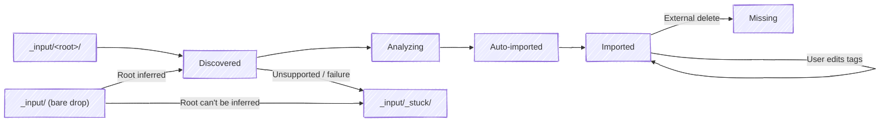
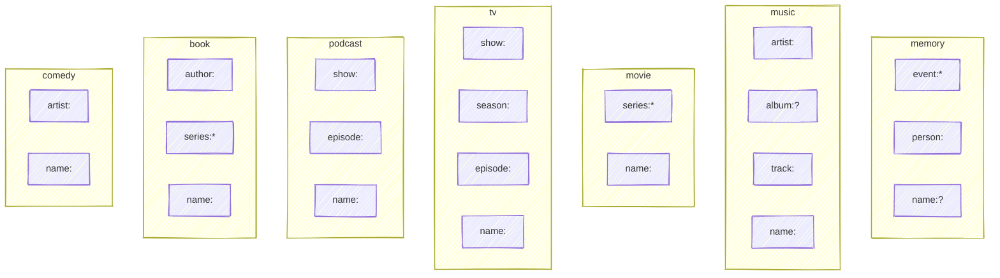
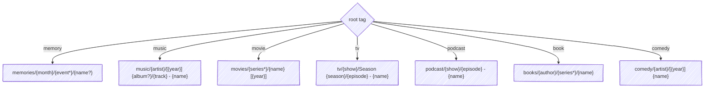
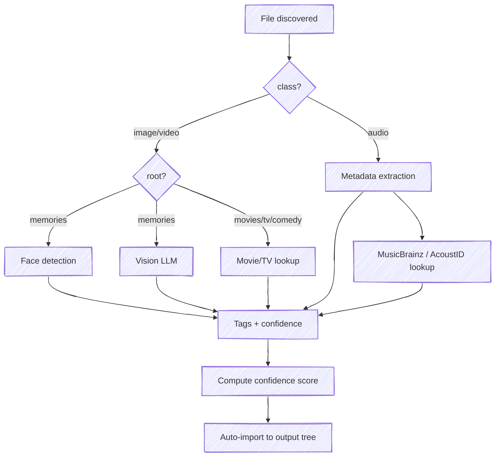
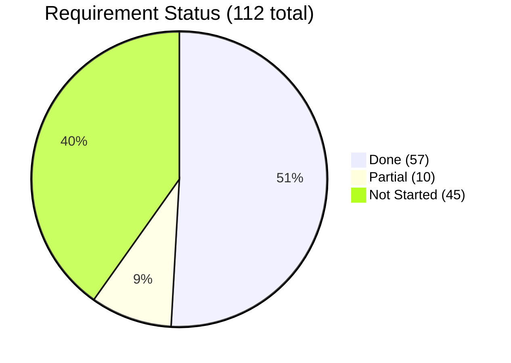

# SPEC.md — Pinpoint Requirements Specification (v0.2)

## Requirements Notation

Each testable requirement has a stable ID in brackets: `[XX-N]`. Code and DECISIONS.md reference these IDs for traceability.

### EARS Syntax

Requirements use the [EARS (Easy Approach to Requirements Syntax)](https://alistairmavin.com/ears) keyword-driven templates:

| Pattern | Keyword | Template |
|---------|---------|----------|
| Ubiquitous | _(none)_ | The system shall \<response\> |
| State-Driven | **While** | While \<precondition\>, the system shall \<response\> |
| Event-Driven | **When** | When \<trigger\>, the system shall \<response\> |
| Optional | **Where** | Where \<feature is included\>, the system shall \<response\> |
| Unwanted Behaviour | **If...then** | If \<condition\>, then the system shall \<response\> |

### Status Annotations

Each requirement includes inline status:
- `Status: Done` — implemented and tested
- `Status: Partial` — some aspects implemented, gaps noted
- `Status: Not Started` — not yet implemented

### Requirement Prefixes

| Prefix | Section |
|--------|---------|
| CM | Core Model (§1) |
| TX | Tag Taxonomy (§2) |
| OP | Output Path (§3) |
| MQ | Review & Refinement (§4) |
| DS | Dedup & Stacking (§5) |
| AI | AI Analysis (§6) |
| LB | Library & Browse (§7) |
| FV | Favorites (§8) |
| FD | File Detail (§9) |
| DM | Data Model (§10) |
| OM | Output Monitoring (§11) |
| TP | Tag Persistence (§12) |
| CF | Configuration (§13) |
| UX | UX Principles (§14) |

---

## Vision

Stop thinking about filenames and folder structures. Just tag your files and let Pinpoint figure out the rest.

Pinpoint is a local-first, tag-based file organization system. Point it at messy folders and walk away — files are automatically analyzed, tagged, and organized into a clean directory tree derived entirely from their tags. Come back later to browse, search, and refine. No manual renaming, no dragging into folders, no deciding where things go.

The system is designed for **immediate value**: point it at a 10,000-file photo library, and within hours every file is organized and browsable. Perfection isn't required up front — users can filter to what matters (baby pictures from 2019, a specific artist's discography) and refine tags at their own pace.

Currently supports images, video, and audio. Designed to extend to any file type.

---

## 1. Core Mental Model

### The Library

A pinpoint **library** is a single directory that contains everything the system manages: an `_input/` folder where files arrive, a `_stuck/` quarantine inside `_input/`, and the per-root output trees as siblings.

```text
<library>/
├── _input/
│   ├── _stuck/           # files pinpoint can't place (failed or unclassifiable)
│   ├── memory/           # drop photos/videos here → root:memory
│   ├── music/            # drop audio here → root:music
│   ├── tv/               # drop TV episodes here → root:tv
│   ├── movie/            # drop films here → root:movie
│   ├── podcast/          # drop podcasts here → root:podcast
│   ├── book/             # drop books here → root:book
│   └── comedy/           # drop stand-up here → root:comedy
├── memories/             # output tree for root:memory
├── music/                # output tree for root:music
├── tv/                   # …and so on
└── …
```

Files become managed by entering `_input/`. Dropping a file into a `_input/<root>/` subdirectory tags it with that root; dropping a file directly into `_input/` lets pinpoint infer the root from content (see [CF-FUT-1]). Pinpoint owns everything below the library root — moving a file from `_input/` to its derived output path (or to `_input/_stuck/`) is an internal rearrangement, never an operation against the user's original file.

- **[CM-1]** The system shall manage a single **library** directory configured via `library:` (see §13). The system shall create and maintain `<library>/_input/<root>/` subdirectories for each known root and `<library>/_input/_stuck/` on startup if they do not already exist. `Status: Done` `Impl: config.py:ensure_library_layout`
- **[CM-2]** The system shall treat any file appearing in `<library>/_input/<root>/` as a discovery with `root:<root>` as the default root tag. The system shall not scan paths outside the library. `Status: Done` `Impl: discovery.py`
- **[CM-CD]** When a watcher event fires on a file in `_input/<root>/`, the system shall delay processing until the file has been quiet (no further filesystem events, stable size and mtime) for a **quiet period** of at least 2 seconds. This gives in-progress copies time to complete before pinpoint reads the file. The quiet period shall be configurable. `Status: Done` `Impl: discovery.py:watch_inputs`
- **[CM-A]** When the system cannot place a file (unsupported class, import failure, or a bare drop whose root can't be inferred), the system shall move the file to `<library>/_input/_stuck/<relative-path>`, preserving the file's relative path under `_input/`. Intermediate directories shall be created as needed. The system shall not re-scan `_input/_stuck/`. `Status: Done` `Impl: discovery.py:_stick_file`

### File Lifecycle



- **[CM-3]** While a file is in the **analyzing** state, the system shall leave the file in place under `_input/<root>/` and compute a **confidence score** (0.0–1.0) from available tag sources. `Status: Done` `Impl: discovery.py`
- **[CM-4]** When a file completes analysis, the system shall tag it, place it in the output tree, and transition it to **imported** status. While a file is imported, the system shall allow tag edits and trigger relocation when path-relevant tags change. `Status: Done` `Impl: api/queue.py:accept_file`

### Import mode

- **[CM-11]** When a file is imported, the system shall **move** the file from `_input/<root>/` to the output tree. The library is the only path under pinpoint's control, so the original-file move/copy distinction does not apply — bringing files into `_input/` is the user's onboarding step (see §13). `Status: Done` `Impl: discovery.py:_auto_import`
- **[CM-5]** The system shall persist tags in each file's native metadata format (EXIF/IPTC/XMP for images, ID3 for MP3, Vorbis comments for FLAC, etc.). The database shall be fully rebuildable by scanning imported files and reading their embedded tags. See §12. `Status: Partial — tag_writer.py writes on accept; rebuild not implemented` `Impl: tag_writer.py`
- **[CM-6]** When analysis completes, the system shall automatically import the file using the best available tags. There shall be no manual approval gate. Files with low confidence shall be flagged for review but still imported. `Status: Done` `Impl: analysis/worker.py`

### Discovery to import — detailed flow

```mermaid
---
config:
  look: handDrawn
---
sequenceDiagram
    participant FS as _input/&lt;root&gt;/
    participant D as Discovery
    participant DB as Database
    participant AI as AI Analysis
    participant P as Path Engine
    participant O as Output Tree
    participant UI as Review UI

    FS->>D: New/changed file detected
    D->>D: Hash file (SHA-256)
    D->>DB: Check for duplicate hash
    alt Duplicate found
        D-->>DB: Skip (don't import)
    else New file
        D->>DB: Insert file (status: analyzing)
        D->>DB: Set root from parent _input subdir
    end

    par Analysis (background)
        DB->>AI: File queued for analysis
        AI->>AI: Extract embedded metadata
        AI->>AI: Parse filename for tags
        AI->>AI: Run analysis pipeline (faces, vision, lookup)
        AI->>DB: Store tags + compute confidence score
    end

    AI->>P: Auto-import: derive path from best tags
    P-->>AI: Deterministic output path
    AI->>O: Move file to output path
    AI->>DB: Update status to imported, store confidence
    AI->>DB: Log auto_import action

    Note over UI: User browses library at leisure
    UI->>UI: Filter to low confidence, date range, root, etc.
    UI->>UI: Edit tags on files that need attention
    UI->>P: Recompute path on tag change
    P->>O: Relocate file if path changed
```

### Confidence scoring

- **[CM-7]** The system shall assign every imported file a **confidence score** (0.0–1.0) reflecting how reliable its auto-assigned tags are. `Status: Done` `Impl: analysis/suggestions.py`
- **[CM-8]** The system shall compute confidence from tag sources, weighted by reliability: `Status: Done` `Impl: analysis/worker.py`

| Source | Weight | Example |
|--------|--------|---------|
| Embedded metadata (ID3, EXIF) | High (0.9) | Artist/album/track from MP3 tags |
| API lookup match (MusicBrainz, TMDb) | High (0.85) | Confirmed via external database |
| Filename parsing (structured patterns) | Medium (0.6) | `S03E05` → season 3, episode 5 |
| Directory structure | Medium (0.5) | Parent folder name → artist |
| AI vision/scene description | Low (0.3) | LLM-suggested event name |
| Fallback defaults | Minimal (0.1) | `_unknown` placeholders |

- **[CM-9]** The system shall compute file-level confidence as the **weighted average** of individual tag confidences, with path-relevant tags weighted more heavily than non-path tags. `Status: Done` `Impl: analysis/worker.py`
- **[CM-10]** The UI shall surface confidence prominently via color-coded indicators, sortable and filterable, so users can focus review time where it matters most. `Status: Partial — confidence shown but not yet sortable/filterable`

---

## 2. Tag Taxonomy

All tags follow a `type:value` structure. Some types support nesting via `:`.

### Universal tag types

#### `root:` — Top-level organizer

Determines the first directory segment and which other tags are path-relevant. Initially set from the `_input/<root>/` subdirectory the file arrives in, overridable per-file during review.

- **[TX-2]** The system shall allow the user to override the `root:` tag per-file during review. `Status: Not Started`

Values: `memory`, `music`, `book`, `podcast`, `movie`, `tv`, `comedy`

#### `date:` — Temporal metadata

Every root has a `date` tag (YYYY-MM-DD). Derived from the best available source, in order: embedded media metadata (EXIF, QuickTime, ID3), a date embedded in the filename (e.g. `IMG_20250115`, `2025-03-01` — common for phone and camera exports), then filesystem dates. If no date can be determined, use the discovery date.

#### `favorite`

- **[TX-5]** The system shall store `favorite` as both a tag and a boolean column for fast sorting. Favorites shall always appear first in any listing. `Status: Partial — schema exists, no UI toggle` `Impl: schema.sql`

#### General tags (no prefix)

Anything without a recognized prefix. For search and filtering only, no path effect.

```
landscape
funny
needs-editing
live-recording
```

### Derived attributes (not tags)

These are computed from file properties and never stored as tags or written to file metadata:

- **[TX-3]** The system shall derive **`class`** (image, video, audio, document) from the file extension. Class shall not be stored as a tag. `Status: Done` `Impl: discovery.py:classify_file`
- **`month`** — `YYYY-MM`, derived from `date`. Used in `memory` path formula.
- **`year`** — `YYYY`, derived from `date`. Used in `music`, `movie`, and `comedy` path formulas.

### Root-specific tag types

Each root defines which tags are path-relevant. The schema below shows every root's tags and output path template (see §3 for full rules).



#### `name:` — Filename (all roots)

- **[TX-4]** When `name:` is set, the system shall replace the original filename in the output path (extension preserved). When `name:` is absent, the system shall keep the original filename. `Status: Done` `Impl: paths.py:_get_name`

If two files share the same `name:` within the same directory scope, they auto-stack and get numeric suffixes "\-1", "\-2", which corresponds to the z-order in the stack. When a stack dissolves to one file, the suffix is removed.

#### `event:` — Memory only

The occasion or context. Supports nesting via `:` — each segment becomes a directory.

```
event:Hawaii Vacation
event:Hawaii Vacation:Snorkeling
event:Birthday Party:Cake Cutting
```

#### `person:` — Memory only

Who is in the photo or video. Maps to face recognition embeddings. Not path-relevant.

- **[TX-1]** The system shall allow multiple `person:` tags per file. The UI shall support multi-value entry (e.g., chip-based input with add/remove) in both the review and file detail views. `Status: Done` `Impl: schema.sql, models.py`

```
person:Eva
person:Max
person:Grandma Rose
```

#### `artist:` — Music and Comedy

The performing artist or band. A track has exactly one `artist:` — the primary credit, which determines the output directory. Collaborators are recorded as `feat:` instead.

```
artist:Pink Floyd
artist:John Mulaney
```

#### `feat:` — Music only (optional, multi-value)

Featured artists on a track. Multiple values are allowed. `feat:` tags are not path-relevant — only the primary `artist:` shapes the output path — so a collaboration files under the primary artist while still recording everyone involved for search.

```
feat:Alicia Keys
feat:Pharrell
```

#### `album:` — Music only

The album name. The `[year]` prefix in the output path is derived from the `year` tag — users enter the album name without a year.

```
album:Dark Side of the Moon
album:Wish You Were Here
album:The Wall
```

#### `track:` — Music only

Track number, zero-padded (minimum 2 digits). Extracted from embedded metadata. Becomes part of the output filename.

```
track:01
track:12
```

#### `author:` — Book only

The book's author.

```
author:Tolkien
author:Ursula K Le Guin
```

#### `series:` — Movie and Book

Groups related works. Supports nesting. Optional — standalone works sit flat without a series directory.

```
series:Indiana Jones
series:Lord of the Rings
series:Harry Potter:Hogwarts Library
```

#### `show:` — TV and Podcast

The series or show name. Becomes a directory.

```
show:The Office
show:Hardcore History
```

#### `season:` — TV only

Season number, zero-padded. Becomes a directory under the show as `Season ##`.

```
season:01
season:03
```

#### `episode:` — TV and Podcast

Episode number, zero-padded. Becomes part of the output filename.

```
episode:01
episode:05
```

### Tag dictionary

- **[TX-6]** The system shall maintain a registry of all known tags with the following behaviors:
  - When a new tag value is used, the system shall auto-register it in the dictionary.
  - The system shall power autocomplete from the tag dictionary in the review UI.
  - The system shall track parent-child hierarchy for nested tags.
  - When filtering by a parent tag, the system shall include all children (e.g. `event:Hawaii Vacation` matches `:Snorkeling` too).
  - The system shall provide a browsable tree view grouped by type.
  `Status: Partial — autocomplete endpoint exists, no tree view` `Impl: api/tags.py`

---

## 3. Output Path Structure

- **[OP-1]** The system shall derive each file's output path deterministically from its tags using the root's fixed path formula. Path templates use the syntax described in §13. `Status: Done` `Impl: paths.py:derive_path — 38 tests`



### `root:memory`

Photos and home video, colocated. Organized by date and event.

```
memories/{tag:month}/{tag:event*}/{tag:name?}<ext>
```

| Tags | Output path |
|---|---|
| (none) | `memories/2025-01/IMG_4521.jpg` |
| `event:Hawaii Vacation` | `memories/2025-01/Hawaii Vacation/IMG_4521.jpg` |
| `event:Hawaii Vacation:Snorkeling` | `memories/2025-01/Hawaii Vacation/Snorkeling/IMG_4521.jpg` |
| `name:Sunset Over Ocean` | `memories/2025-01/Sunset Over Ocean.jpg` |
| `event:Hawaii Vacation:Snorkeling`, `name:Sunset Over Ocean` | `memories/2025-01/Hawaii Vacation/Snorkeling/Sunset Over Ocean.jpg` |

- **[OP-2]** The system shall derive `month` (YYYY-MM) from `date`, determined from the best available source, in order: embedded media metadata (EXIF, QuickTime), a date embedded in the filename, then filesystem dates. If no date can be determined, then the system shall use the discovery date. `Status: Partial — EXIF (images) + filename (images/video), not QuickTime` `Impl: discovery.py:_exif_capture_date, _filename_date`

### `root:music`

Songs. Organized by artist. Albums include release year for chronological browsing.

```
music/{tag:artist}/[{tag:year}] {tag:album?}/{tag:track} - {tag:name}<ext>
```

- **[OP-3]** The system shall zero-pad `track` to a minimum of 2 digits for ordinal sorting. When no track number is available, the system shall use the name alone (no "\-" separator). `Status: Done` `Impl: paths.py:_derive_music, defaults.py:extract_audio_metadata`
- **[OP-4]** When embedded metadata contains `albumartist = "Various Artists"`, the system shall set `artist:Various Artists` and preserve the original filename as-is. `Status: Done` `Impl: defaults.py:_defaults_music, paths.py:_derive_music`
- **[OP-5]** When artist metadata credits more than one artist — either as multiple artist frames or via a `feat.`/`ft.`/`featuring` marker in a single string — the system shall keep the first as the primary `artist:` and record the remainder as `feat:` tags. The primary artist string shall not be split on `&`/`,` so band names (e.g. `Earth, Wind & Fire`) stay intact; only the segment after a feat marker is split into multiple collaborators. `Status: Done` `Impl: defaults.py:parse_artists`

| Tags | Output path |
|---|---|
| `artist:Pink Floyd`, `album:Dark Side of the Moon`, `year:1973`, `track:01`, `name:Time` | `music/Pink Floyd/[1973] Dark Side of the Moon/01 - Time.flac` |
| `artist:Pink Floyd`, `name:Another Brick` | `music/Pink Floyd/Another Brick.mp3` |
| `artist:Various Artists`, `album:8 Mile Soundtrack`, `year:2002` | `music/Various Artists/[2002] 8 Mile Soundtrack/15 - Gang Starr - Battle.mp3` *(original filename)* |
| `artist:Jay-Z`, `feat:Alicia Keys`, `name:Empire State of Mind` | `music/Jay-Z/Empire State of Mind.mp3` *(`feat:` is not path-relevant)* |
| `name:Mystery Track` | `music/_unknown/Mystery Track.mp3` |
| (none) | `music/_unknown/track-01.mp3` *(original filename)* |

Browsing `music/Pink Floyd/` in Finder gives you:
```
[1967] The Piper at the Gates of Dawn/
[1973] Dark Side of the Moon/
[1975] Wish You Were Here/
[1979] The Wall/
```

### `root:movie`

Feature films. Optionally grouped by series/franchise. Year appended for disambiguation.

```
movies/{tag:series*}/{tag:name} [{tag:year}]<ext>
```

| Tags | Output path |
|---|---|
| `name:The Dark Knight`, `year:2008` | `movies/The Dark Knight [2008].mkv` |
| `series:Indiana Jones`, `name:Raiders of the Lost Ark`, `year:1981` | `movies/Indiana Jones/Raiders of the Lost Ark [1981].mkv` |
| `series:Lord of the Rings`, `name:The Fellowship of the Ring`, `year:2001` | `movies/Lord of the Rings/The Fellowship of the Ring [2001].mkv` |
| (none) | `movies/movie.mkv` *(original filename)* |

`series:` is optional — standalone films sit flat in `movies/`. `series:` supports nesting for sub-franchises. TMDb lookups suggest `name`, `year`, and `series` from collection metadata.

### `root:tv`

TV series episodes. Organized by show and season.

```
tv/{tag:show}/Season {tag:season}/{tag:episode} - {tag:name}<ext>
```

| Tags | Output path |
|---|---|
| `show:The Office`, `season:03`, `episode:05`, `name:The Merger` | `tv/The Office/Season 03/05 - The Merger.mkv` |
| `show:The Office`, `season:03`, `episode:05` | `tv/The Office/Season 03/05.mkv` *(original filename)* |
| `show:The Office` | `tv/The Office/episode.mkv` *(original filename)* |

### `root:podcast`

Podcast episodes. Organized by show.

```
podcast/{tag:show}/{tag:episode} - {tag:name}<ext>
```

| Tags | Output path |
|---|---|
| `show:Hardcore History`, `episode:66`, `name:Supernova in the East` | `podcast/Hardcore History/66 - Supernova in the East.mp3` |
| `show:Hardcore History` | `podcast/Hardcore History/episode.mp3` *(original filename)* |
| (none) | `podcast/_unknown/episode.mp3` *(original filename)* |

### `root:book`

Audiobooks. Organized by author, optionally grouped by series.

```
books/{tag:author}/{tag:series*}/{tag:name}<ext>
```

| Tags | Output path |
|---|---|
| `author:Tolkien`, `name:The Hobbit` | `books/Tolkien/The Hobbit.m4a` |
| `author:Tolkien`, `series:Middle Earth`, `name:The Hobbit` | `books/Tolkien/Middle Earth/The Hobbit.m4a` |
| `author:Ursula K Le Guin`, `series:Earthsea`, `name:A Wizard of Earthsea` | `books/Ursula K Le Guin/Earthsea/A Wizard of Earthsea.m4a` |
| (none) | `books/_unknown/book.m4a` *(original filename)* |

### `root:comedy`

Standup specials and sketches. Organized by performer. Year prepended for chronological sorting.

```
comedy/{tag:artist}/[{tag:year}] {tag:name}<ext>
```

| Tags | Output path |
|---|---|
| `artist:John Mulaney`, `name:Kid Gorgeous`, `year:2018` | `comedy/John Mulaney/[2018] Kid Gorgeous.mp4` |
| `artist:John Mulaney` | `comedy/John Mulaney/special.mp4` *(original filename)* |

### Tag value casing

- **[OP-5]** The system shall normalize tag values to **Title Case** with spaces as word separators. Minor words (a, an, the, and, or, of, in, on, etc.) shall stay lowercase unless first or last. `Status: Done` `Impl: defaults.py:slugify, defaults.py:title_case — 12 tests`

```
artist:Pink Floyd
album:Dark Side of the Moon
name:The Dark Knight
event:Hawaii Vacation:Snorkeling
author:Ursula K Le Guin
```

Defaults derived from embedded metadata or folder structure are automatically converted to this convention.

### Year is metadata, not part of name/album

- **[OP-6]** The system shall derive `[year]` in output paths automatically from the `year` tag. Users enter the name/album without a year — the year is a separate tag. `Status: Done` `Impl: paths.py:_derive_music`

### General rules

- **[OP-7]** When `name:` is set, the system shall replace the filename. When `name:` is absent, the system shall keep the original filename. `Status: Done` `Impl: paths.py:_get_name`
- **[OP-8]** If a required path segment is missing, then the system shall use `_unknown` as a placeholder. `Status: Done` `Impl: paths.py:_first_or`
- **[OP-9]** When duplicate filenames occur within the same directory scope, the system shall auto-stack them with numeric suffixes ("\-1", "\-2", etc.). `Status: Done` `Impl: api/queue.py:_resolve_collision`
- **[OP-10]** When a stack dissolves to one file, the system shall remove the numeric suffix. `Status: Not Started`
- **[OP-11]** When any path-affecting tag changes on an imported file, the system shall relocate the file and clean up empty parent directories. `Status: Done` `Impl: api/tags.py:save_tags`

---

## 4. Review & Refinement

Files are auto-imported as soon as analysis completes (see §1). The review UI is for browsing, filtering, and refining tags on files that need attention — not for gatekeeping every import.

### Import status

- **[MQ-1]** While files are being processed, the sidebar shall show an **import progress indicator**: files analyzing, recently imported count, and a badge for files needing review (confidence below threshold). `Status: Partial — count on page, no sidebar`
- **[MQ-2]** The system shall import files fully unattended. A large library pointed at Pinpoint for the first time shall be fully organized within hours, not weeks. `Status: Done`

### Needs Review view

- **[MQ-3]** The Needs Review view shall be accessible via sidebar and shall show imported files sorted by **confidence ascending** (lowest confidence first). `Status: Partial — queue exists but sorted newest-first, not by confidence`
- **[MQ-4]** The Needs Review view shall be filterable by: root, file class, confidence range, date range, specific missing tags. `Status: Partial — root + class filters on queue`
- **[MQ-5]** Each file in the Needs Review view shall show: preview thumbnail, current tags (with source indicators), confidence score, and the current output path. `Status: Done` `Impl: templates/queue.html`

### Single-file review

- **[MQ-6]** The single-file review shall provide a full-size preview (image viewer, video player, audio player). `Status: Done` `Impl: templates/queue.html, api/files.py`
- **[MQ-7]** The single-file review shall display file metadata: filename, size, dimensions/duration, creation date, source path. `Status: Done` `Impl: templates/queue.html`
- **[MQ-8]** While the user edits tags, the system shall display a **live preview of the output path** that updates in real time. `Status: Done` `Impl: api/tags.py:preview_path`
- **[MQ-9]** The system shall show tag source indicators for each default: `Status: Done` `Impl: templates/queue.html — AI badge + source labels`

| Indicator | Meaning |
|-----------|---------|
| `metadata` | Extracted from embedded file metadata (ID3, EXIF, etc.) |
| `filename` | Parsed from filename or directory structure |
| `api` | Matched via external API (MusicBrainz, TMDb) |
| `ai` | Suggested by local AI (vision model, face detection) |
| `manual` | Entered or edited by the user |

- **[MQ-10]** When a user edits a tag, the system shall trigger immediate relocation if path-relevant tags changed. The system shall set confidence for edited tags to 1.0 (manual = certain). `Status: Done` `Impl: api/tags.py:save_tags`

### Batch review

Preview an entire folder or group at once. Useful for bulk refinement.

- **[MQ-11]** The batch review shall provide a table/list view showing: filename, current tags, confidence, output path. `Status: Not Started`
- **[MQ-12]** When the user selects multiple files, the system shall support bulk tag application (e.g., set `event:` for an entire folder of photos). `Status: Not Started`
- **[MQ-13]** The batch review shall allow individual rows to expand for single-file editing. `Status: Not Started`

### Removing files

There is no reject/delete action in the UI. If a user wants to remove a file from the library, they use **"Show in Finder"** (see [LB-8]) and delete or move it themselves. The output monitor (§11) detects the change and marks the file as `missing`. This keeps the UI simple and leverages tools users already know.

### Tag fields by root

Fields shown depend on the root:

| Root | Fields shown |
|---|---|
| `memory` | Event, Name, Person, Tags |
| `music` | Artist, Album, Year, Track, Name, Tags |
| `movie` | Series (optional), Title, Year, Tags |
| `tv` | Show, Season, Episode, Name, Tags |
| `podcast` | Show, Episode, Name, Tags |
| `book` | Author, Series (optional), Title, Tags |
| `comedy` | Artist, Title, Year, Tags |

Each field has contextual labels and placeholder text appropriate to the root.

### Completeness indicators

Which tags are "expected" depends on the root:

| Root | Expected |
|---|---|
| `memory` | `event:` + `name:` |
| `music` | `artist:` + `album:` + `name:` |
| `movie` | `name:` |
| `tv` | `show:` + `season:` + `episode:` + `name:` |
| `podcast` | `show:` + `episode:` + `name:` |
| `book` | `author:` + `name:` |
| `comedy` | `artist:` + `name:` |

- Missing expected tags contribute to low confidence and are visually indicated with a dot marker on the field label.
- Files with all expected tags filled from high-confidence sources rarely need review.

---

## 5. Deduplication & Stacking

### Exact duplicates

- **[DS-1]** When discovering a file, the system shall compute a content hash (SHA-256). If the hash matches an existing file, then the system shall skip the duplicate (never import it). `Status: Done` `Impl: discovery.py:hash_file`

### Perceptual similarity (images only)

- **[DS-2]** When discovering an image, the system shall compute a perceptual hash. When two files have a hamming distance below a configurable threshold, the system shall auto-stack them. `Status: Done` `Impl: 0.2/1-hybrid discovery.py:_compute_phash, _find_phash_stack`

### Name-collision stacking

- Files sharing a `name:` within the same directory scope auto-stack.
- Filenames get numeric suffixes: `beach-sunset-1.jpg`, `beach-sunset-2.jpg`.
- User can reorder z-order within the stack.

### Stack behavior

- Cover file shown in grid views, badge for stack depth.
- Manage: reorder, set cover, remove members, dissolve.
- Stack of one auto-dissolves (suffix removed).

---

## 6. AI Analysis Pipeline

All analysis runs locally. No cloud APIs except free/open music metadata lookup.



### Background worker

- **[AI-0]** When analysis completes for a discovered file, the system shall auto-import it using the best available tags. There shall be no manual gate. `Status: Done` `Impl: analysis/worker.py:run_analysis`
- Processes files newest first. Degrades gracefully: if any analysis tool is unavailable, skip it and proceed with whatever tags are available.
- Files are imported even if confidence is low — `_unknown` placeholders are acceptable. The user refines later.

### Image/video analysis

#### Face detection and recognition

- Detect faces in images using a local face detection library. Optionally match against a directory of labeled reference photos (filename = person label).
- Detected faces become `person:` tag suggestions with bounding box regions.
- Unknown faces prompt the user to assign a label during review, which is stored for future recognition.
- Silently skipped if no face detection library is available.

#### Scene description

- Send images to a local vision model for scene description.
- Model suggests event, name, and general tags.
- Images should be downscaled before sending to keep inference fast on CPU.
- Silently skipped if no vision model is available.

### Audio analysis

#### Metadata extraction

- **[AI-1]** The system shall read embedded audio tags (ID3, Vorbis, MP4 atoms, etc.) during analysis. `Status: Done` `Impl: defaults.py:extract_audio_metadata`
- **[AI-2]** The system shall extract: title, artist, album, year, genre, track number, and album art from audio metadata. `Status: Done` `Impl: defaults.py:extract_audio_metadata`
- **[AI-3]** When discovering files in directories that contain audio files, the system shall auto-skip images (cover art, booklet scans). `Status: Done` `Impl: discovery.py:_walk_files`

#### Free API lookup

- **MusicBrainz**: lookup by artist+title for canonical metadata.
- **AcoustID**: audio fingerprinting to identify unknown tracks.
- Results mapped to tag suggestions based on the file's root:

| Source | `root:music` | `root:book` | `root:podcast` |
|---|---|---|---|
| Artist/Author | `artist:` | `author:` | — |
| Album/Title | `album:` | `name:` | `show:` |
| Year | `year:` | — | — |
| Track/Chapter | `track:` + `name:` | `name:` | `episode:` + `name:` |

### Movie/TV analysis

For files in `root:movie`, `root:tv`, and `root:comedy` — attempt to identify the content from the original filename (which often contains the title, year, season/episode numbers, or release group tags).

#### Filename parsing

- Extract likely title, year, season/episode numbers from common naming patterns (e.g. `The.Office.S03E05.720p.mkv`, `There Will Be Blood (2007).mp4`, `John.Mulaney.Kid.Gorgeous.2018.WEBRip.mp4`).

#### Free API lookup

- **TMDb (The Movie Database)**: free API, search by title+year for movies and TV. Returns canonical title, year, overview, genres, cast.
- TMDb TV endpoints: lookup by show+season+episode for episode titles.
- Results mapped to tag suggestions:

| Source | `root:movie` | `root:tv` | `root:comedy` |
|---|---|---|---|
| Title | `name:` | `show:` | `name:` |
| Year | `year:` | — | `year:` |
| Collection/Franchise | `series:` | — | — |
| Episode title | — | `name:` | — |
| Season/Episode | — | `season:` + `episode:` | — |
| Performer/Director | — | — | `artist:` |

### Tag resolution and auto-import

- **[AI-4]** The system shall store analysis results as tags with source and confidence metadata. The system shall select the best available value for each tag field automatically: embedded metadata > API lookup > filename parsing > AI suggestion > `_unknown`. `Status: Done` `Impl: analysis/suggestions.py, schema.sql:suggestions`
- **[AI-5]** When analysis completes, the system shall auto-import the file: persist tags, derive the output path, and move the file to the output tree with an overall confidence score. `Status: Done` `Impl: analysis/worker.py`
- **[AI-6]** When a face is detected but unrecognized, the system shall store it as an unidentified face region. When the user later labels a face, the system shall use that label for future recognition across all files. `Status: Not Started`
- **[AI-7]** The review UI shall show the analysis source for each tag so users can see why a tag was assigned and override with confidence. `Status: Done` `Impl: web/routes.py, templates/queue.html`

### Filename parsing patterns

- **[AI-8]** The system shall recognize the following filename patterns across roots: `Status: Done` `Impl: analysis/tmdb.py`

| Pattern | Example | Extracted tags |
|---------|---------|----------------|
| `S##E##` | `The.Office.S03E05.720p.mkv` | show, season, episode |
| `(YYYY)` or `[YYYY]` | `There Will Be Blood (2007).mp4` | year, name (text before year) |
| `## - Title` | `01 - Time.flac` | track, name |
| `YYYY.Name` | `John.Mulaney.Kid.Gorgeous.2018.WEBRip.mp4` | year, name (dots → spaces) |
| Directory structure | `Pink Floyd/[1973] Dark Side of the Moon/` | artist, year, album |

- Dot-separated words are converted to spaces. Common release-group suffixes (720p, WEBRip, x264, etc.) are stripped before extracting the title.

### Various Artists handling

- **[AI-9]** When embedded metadata contains `albumartist = "Various Artists"` (or equivalent), the system shall set `artist:Various Artists` and preserve the original filename as-is. `Status: Done` `Impl: defaults.py:_defaults_music`

---

## 7. Search and Browsing

The home page. The default landing experience is searching and browsing the library.

### Search

- **[LB-1]** The home page shall provide a full-text search bar that searches across filenames, tag values, metadata, and AI descriptions. `Status: Partial — FTS5 in schema, LIKE search wired, FTS not wired`
- **[LB-1a]** While the user types 2 or more characters, the system shall auto-update search results with a short debounce delay (~300ms). No submit button shall be required. `Status: Not Started`
- **[LB-2]** The system shall display search results as a grid of **folders** (see below) and individual files. `Status: Not Started`
- **[LB-3]** The system shall provide filters to narrow results:
  - Root (memories, music, tv, etc.).
  - Class (image, video, audio).
  - Date range.
  - Person / Artist / Author (context-appropriate label per root).
  - Tags — multiple = AND. Parent tags include children.
  `Status: Partial — root + class filters on queue`

### Folders

A **folder** is a virtual grouping of imported files, derived from the primary grouping segment of each root's path formula. Each folder has a **name** and a **hero image**.

- **[LB-4]** The home page shall show folders as cards (hero image + name) as the primary browsing unit. `Status: Not Started`
- **[LB-4a]** When the user clicks a folder card, the system shall drill down into that folder, showing subfolders and files with breadcrumb navigation. `Status: Not Started`
- **[LB-5]** The system shall use the first image file (by date) as the hero image, or the stack cover if one exists. If no image is available, then the system shall fall back to a file-type icon. `Status: Not Started`

| Root | Folder grouping tags | Grouping depth | Example folder name |
|------|---------------------|----------------|-------------------|
| memory | `event:` | 1 | "Hawaii Vacation" |
| music | `artist:`, `album:` | 2 | "Pink Floyd — Dark Side of the Moon" |
| movie | `series:` | 1 | "Indiana Jones" |
| tv | `show:`, `season:` | 2 | "The Office — Season 3" |
| podcast | `show:` | 1 | "Hardcore History" |
| book | `author:` | 1 | "Tolkien" |
| comedy | `artist:` | 1 | "John Mulaney" |

- **[LB-4b]** The system shall collapse path segments up to the **grouping depth** into a single folder card. Files deeper than the grouping depth shall appear as contents within the folder. Files at or above the grouping depth shall appear as standalone items. `Status: Not Started`

- **[LB-6]** When a file lacks a grouping tag (e.g., a movie with no `series:`), the system shall display it as a standalone item alongside folders. `Status: Not Started`
- **[LB-7]** When the user clicks a folder, the system shall show its contents as individual files with contextual icons:
  - Audio: play icon (&#9654;) — click to play inline.
  - Images: image icon — click to open/preview.
  - Video: film icon — click to open/preview.
  `Status: Partial — tree view exists in templates/library.html`
- **[LB-8]** The system shall offer **"Open in Finder"** (macOS) / **"Open in file manager"** actions at every level: folder cards, subfolder headings, and individual files. `Status: Not Started`
- Favorites marked with a star indicator. Favorites sort first.

### What's New

- **[LB-9]** The What's New view shall show recently imported files, sorted by `imported_at` descending. `Status: Not Started`
- **[LB-10]** The What's New view shall group entries by import date (today, yesterday, this week, earlier). Each entry shall show the file preview, assigned tags, confidence, and root. `Status: Not Started`

### On This Day

- **[LB-11]** The system shall provide an "On This Day" view showing files from date-based roots (`memories`) matching today's month+day across all years, grouped by year with favorites first. `Status: Not Started`

### Tag dictionary browser

- **[LB-12]** The system shall provide a tag dictionary browser as a tree view grouped by type, with usage counts. When the user clicks a tag, the system shall filter the library to that tag. `Status: Not Started`

---

## 8. Favorites

- **[FV-1]** The system shall store `favorite` as a built-in tag and boolean column for fast sorting. `Status: Done` `Impl: schema.sql`
- **[FV-2]** The UI shall provide a star toggle on cards and detail views. `Status: Not Started`
- **[FV-3]** The system shall always sort favorites first in any listing. The system shall provide a dedicated favorites view in the sidebar. `Status: Not Started`

---

## 9. File Detail View

- **[FD-3]** The file detail view shall provide a full-size preview (image/video/audio) in overlay. `Status: Not Started`
- **[FD-4]** The file detail sidebar shall show: favorite toggle, metadata, all tags (editable with source indicators per [MQ-9]), confidence score, and face regions for `person:` tags. `Status: Partial — tag editor exists` `Impl: web/routes.py:file_detail_page, templates/file_detail.html`
- **[FD-5]** The file detail view shall provide a **"Show in Finder"** button to open the file's location in the native file manager. `Status: Not Started`

### Preview serving

- **[FD-1]** The server shall expose a `/preview/:id` endpoint that serves file content for in-browser display. While a file is imported, the system shall serve from `output_path`. While a file is still analyzing (not yet moved), the system shall serve from the file's current location under `_input/<root>/`. `Status: Not Started`
- **[FD-2]** The preview endpoint shall support streaming for large video/audio files via HTTP range requests. `Status: Not Started`

---

## 10. Data Model

### Core entities

- **[DM-2]** The system shall maintain the following core tables: `Status: Done` `Impl: schema.sql, database.py`
  - **files** — every known file. Tracks: `output_path`, lifecycle status (`analyzing`/`imported`/`stuck`/`missing`/`drifted`), root, class, content hash, perceptual hash, temporal metadata (`creation_date`, `discovery_date`, `imported_at`), favorite flag, stack membership, analysis state, **confidence score** (0.0–1.0), `last_indexed_at` (timestamp of last audit — validates input tags and output filename consistency). Files in the `stuck` state have `output_path` pointing into `_input/_stuck/`.
  - **tags** — tag dictionary. Tracks: full name (e.g. `event:hawaii-vacation:snorkeling`), type (root/event/name/person/artist/author/album/title/show/season/series/general), whether built-in.
  - **file_tags** — associates files with tags. Tracks: region (face bounding box if applicable), when applied, **source** (`metadata`/`filename`/`api`/`ai`/`manual`), **confidence** (0.0–1.0 for this specific tag assignment).
- **[DM-3]** The system shall maintain the following supporting tables: `Status: Done` `Impl: schema.sql`
  - **suggestions** — AI analysis results before they become tags. Tracks: target file, kind, suggested value, confidence, region, status (pending/applied/dismissed). Once auto-import applies a suggestion, it becomes a file_tag.
  - **stacks** — groups of similar or colliding files. Tracks: cover file, member ordering.
  - **known_faces** — labeled face embeddings for recognition. Tracks: label, embedding vector, source reference.
- **full-text search index** — across filenames, tag names, metadata, AI descriptions.

### Action log

- **[DM-1]** The system shall maintain an **actions** table as an append-only audit trail of every state-changing operation. `Status: Done` `Impl: actions.py:log_action, all 17 verbs in models.py`
  - timestamp
  - action verb: `discover`, `auto_import`, `stuck`, `delete`, `tag_add`, `tag_remove`, `tag_edit`, `favorite`, `unfavorite`, `relocate`, `rename`, `move`, `missing`, `stack_create`, `stack_reorder`, `stack_dissolve`
  - file id (nullable for system-level actions)
  - detail payload — action-specific context, e.g.:
    - `auto_import`: source path, destination path, confidence score
    - `relocate`: old path, new path, which tag change triggered it
    - `tag_add`: tag name, source, confidence, region if applicable
    - `tag_edit`: old value, new value, field name
    - `delete`: path, whether file was imported
    - `discover`: source path, content hash
    - `rename`: old path, new path (external change)
    - `move`: old path, new path (external change)
    - `missing`: expected path

Not used for undo — just a queryable log for debugging and manual error recovery.

---

## 11. Output Monitoring

The library is a regular folder. Users may interact with it directly via Finder, terminal, or other tools. Pinpoint watches the library and responds to external changes. The output trees (`memories/`, `music/`, …) and `_input/` are watched; `_input/_stuck/` is not re-scanned (see [CM-A]).

### File renamed

- **[OM-1]** When a file at a known `output_path` disappears and a new file with the same size/hash appears in the same directory, the system shall detect this as a rename. `Status: Not Started`
- **[OM-2]** When a rename is detected, the system shall update `output_path` in the database. `Status: Not Started`
- **[OM-3]** When a rename is detected, the system shall log a `rename` action with old and new paths. `Status: Not Started`
- **[OM-4]** When a file is renamed externally, the system shall **not** reverse-derive tags from the new filename. Tags remain the source of truth. The file shall be marked as "drifted." `Status: Not Started`
- Optionally surface drifted files in the UI so the user can reconcile (re-tag to match, or trigger a relocate to snap back).

### File moved

- Detect via watcher (file disappears from known path, same hash appears elsewhere in output tree).
- Update `output_path`.
- Log a `move` action with old and new paths.
- Same drift handling as rename — tags don't change, file is marked as drifted.

### File deleted externally

- **[OM-5]** When a file at a known `output_path` no longer exists and no matching hash is found elsewhere, the system shall detect this as an external delete. `Status: Not Started`
- **[OM-6]** When an external delete is detected, the system shall mark the file as `missing` (not deleted from DB — preserve metadata and action history). `Status: Not Started`
- **[OM-7]** When an external delete is detected, the system shall log a `missing` action. `Status: Not Started`
### Missing files view

- **[OM-8]** While missing files exist, the system shall surface them in a dedicated view accessible from the sidebar. `Status: Not Started`
- **[OM-9]** Each missing file entry shall show: the file's last known path, root, tags, and when it went missing. `Status: Not Started`
- **[OM-10]** When the user dismisses a missing record, the system shall remove the file from the database. The system shall support "dismiss all." No confirmation dialog — dismissed records shall be visible in the action log. `Status: Not Started`

### New file added to output

- Detect via watcher (unknown file appears in output tree).
- Treat it like a discovery: hash it, check for duplicates, run through the analysis pipeline.
- Attempt to reverse-derive tags from the path (e.g. a file at `music/pink-floyd/[1973] dark-side-of-the-moon/time.flac` → derive `root:music`, `artist:pink-floyd`, `album:dark-side-of-the-moon`, `year:1973`, `name:time`).
- Since the file is already in the output tree, auto-import registers it as imported in-place (no move needed).

### Periodic verification

- On startup (and optionally on a schedule), scan all imported files and verify they exist at their expected paths.
- Surface any missing or drifted files.

## 12. Tag Persistence

### Principle: files are the source of truth

Imported files must be self-describing. Pinpoint writes tags into each file using the most native metadata format available for that file type. The database is a cache — it must be fully rebuildable by scanning the output directory and reading embedded tags from imported files.

### Native formats by file type

| File type | Write tags to | Read tags from |
|---|---|---|
| JPEG | EXIF/IPTC/XMP (e.g. `dc:subject`, IPTC keywords) | Same |
| PNG | XMP sidecar or tEXt chunks | Same |
| TIFF | EXIF/IPTC/XMP | Same |
| MP4/MOV | XMP embedded or QuickTime user data | Same |
| MP3 | ID3v2 frames (e.g. `TXXX` for custom tags) | ID3v1/v2 |
| FLAC/OGG | Vorbis comments | Same |
| M4A/AAC | MP4 atoms / iTunes-style tags | Same |
| PDF | XMP metadata | Same |
| Other | XDG extended attributes (`user.pinpoint.*`) | Same |

### Tag storage — no custom metadata format

Pinpoint never invents its own metadata format. Every tag is stored using an existing standard or derived from the file itself.

| Tag | Storage | Source |
|---|---|---|
| `date` | Native metadata | `DateTimeOriginal` (EXIF), `TDRC` / `DATE` (ID3/Vorbis) |
| `event` | Native metadata | `Iptc4xmpExt:Event` |
| `person` | Native metadata | `XMP-mwg-rs:RegionName` (face regions) |
| `artist` | Native metadata | `TPE1` / `ARTIST` (ID3/Vorbis) |
| `album` | Native metadata | `TALB` / `ALBUM` (ID3/Vorbis) |
| `name` | Native metadata | `TIT2` / `TITLE` (ID3/Vorbis); also in output filename |
| `track` | Native metadata | `TRCK` / `TRACKNUMBER` (ID3/Vorbis) |
| `author` | Native metadata | `dc:creator` (XMP/PDF) |
| `show`, `season`, `episode`, `series` | Output path | Derived from directory structure |
| `root` | Extended attribute | `user.pinpoint.root` |
| `favorite` | Extended attribute | `user.pinpoint.favorite` |
| General tags | Extended attribute | `user.pinpoint.tag.*` |
| `class` | Computed | Derived from file extension (not stored) |
| `month`, `year` | Computed | Derived from `date` (not stored) |

- **[TP-1]** The system shall write tags with native metadata fields to those fields directly and read from the same fields. `Status: Done` `Impl: tag_writer.py:_write_audio_tags, _write_image_tags`
- **[TP-2]** The system shall store format-agnostic tags (`root`, `favorite`, general tags) as extended attributes. `Status: Done` `Impl: tag_writer.py:_write_xattrs`
- **[TP-3]** The system shall not write tags derivable from the output path or the file itself — they shall be reconstructed on read. `Status: Done` `Impl: tag_writer.py:PATH_DERIVED_TAGS, COMPUTED_TAGS`
- **[TP-4]** When auto-importing a file (or on manual tag edit), the system shall write native metadata and xattrs before moving the file to the output tree. `Status: Done` `Impl: api/queue.py:accept_file`
- **[TP-5]** When a tag changes on an imported file, the system shall rewrite metadata and relocate the file if path-relevant tags changed. `Status: Done` `Impl: api/tags.py:save_tags`

### Extended attributes

- **[TP-6]** Where running on macOS, the system shall mirror **low-cardinality** tags to `com.apple.metadata:_kMDItemUserTags` so they appear as Finder tags and are indexed by Spotlight. `Status: Done` `Impl: tag_writer.py:_write_finder_tags`
  - **[TP-6a]** The system shall always write: `pinpoint` (app identifier) and `pinpoint:<root>` (category).
  - **[TP-6b]** The system shall promote `person` to Finder tags — included because most users tag a small set of known people.
  - **[TP-6c]** The system shall not promote `artist`, `album`, `event`, `author`, `show`, and other high-cardinality fields to Finder tags. These shall be queryable via individual xattrs only.
- **[TP-7]** When discovering a file, the system shall import existing Finder tags / xattrs as suggestions. `Status: Not Started`
- **[TP-8]** Where running on Linux, the system shall use the `user.*` xattr namespace. Where running on macOS, the system shall use both `user.pinpoint.*` and the Finder tag namespace. `Status: Done` `Impl: tag_writer.py:_write_xattrs`

### Database rebuild

- **[TP-9]** When the user runs `pinpoint rebuild`, the system shall scan the output directory, read native metadata + xattrs + path structure from every imported file, and reconstruct the `files`, `tags`, and `file_tags` tables. `Status: Not Started`
- **[TP-10]** The system shall not attempt to recover action history during rebuild (append-only log is database-only). `Status: Done` `Impl: actions.py`
- **[TP-11]** When rebuilding, the system shall cross-check each file's directory position against its embedded tags. If the position is inconsistent with the tags, then the system shall flag the file as drifted. `Status: Not Started`

---

## 13. Configuration

Minimal. A library path. Everything else has sensible defaults in code.

```yaml
library: /Volumes/data/files
```

The library directory holds both the `_input/` drop tree and the per-root output trees. Pinpoint creates `_input/<root>/` and `_input/_stuck/` on startup if they don't exist.

- **[CF-LIB]** The system shall require a `library:` path in config. There is no default — the user shall pick a location (typically an external drive). The library shall not default to the user's home directory. `Status: Not Started`
- **[CF-10]** When the config file changes on disk, the system shall hot-reload the configuration without requiring a restart. `Status: Partial — ConfigHolder exists, watcher not connected` `Impl: config.py`

### Onboarding

The preferred onboarding pattern: pick a library root, then move existing files into the appropriate `_input/<root>/` subdirectory. From there, pinpoint takes over.

```mermaid
---
config:
  look: handDrawn
---
sequenceDiagram
    participant U as User
    participant FS as File System
    participant L as &lt;library&gt;/_input/&lt;root&gt;/
    participant P as Pinpoint
    participant O as &lt;library&gt;/&lt;root output tree&gt;/

    U->>FS: Pick library root (e.g. /Volumes/data/files)
    P->>L: On first run, create _input/&lt;root&gt;/ and _input/_stuck/
    U->>L: mv ~/old/music/* /Volumes/data/files/_input/music/
    U->>L: mv ~/old/photos/* /Volumes/data/files/_input/memory/
    L-->>P: Watcher detects new files
    P->>P: Hash, dedup, analyze, derive path
    alt Successful import
        P->>O: Move file to derived output path
    else Unsupported / failure
        P->>L: Move file to _input/_stuck/
    end
```

A file is "under pinpoint control" the moment it lands in `_input/`. Whether the user moved it there from another disk, copied it, AirDropped it, or piped a download into it — that's their concern, not pinpoint's.

- **[CF-OB]** The system shall not require any pre-population of `_input/<root>/`. An empty library is valid and produces an empty output tree. `Status: Not Started`

### Bare-drop classifier inference

- **[CF-FUT-1]** When a file is dropped at the root of `_input/` (not inside a `_input/<root>/` subdirectory), the system shall infer the root from file class and content: images → `memory`, audio → `music`, documents with a book extension (`.epub`, `.mobi`, `.azw`, `.azw3`, `.pdf`) → `book`, video with an `SxxExx` marker → `tv`, video with a year → `movie`. Where the root can't be inferred, the system shall move the file to `_input/_stuck/` with a reason. `Status: Done` `Impl: discovery.py:infer_root, discover_input_root_file`

### System paths

- **[CF-1]** The system shall store its database, thumbnails, and system data in a **data directory** defaulting to `~/.pinpoint/`. The data directory shall be configurable via `data_dir:` in config or `PINPOINT_DATA_DIR` environment variable. The data directory is separate from the library — only the database and system state live here. `Status: Done` `Impl: config.py`
- **[CF-2]** The system shall load configuration from `~/.pinpoint/config.yaml` by default, overridable via `--config <path>` or `PINPOINT_CONFIG` environment variable. `Status: Done` `Impl: config.py, __main__.py`
- **[CF-3]** The system shall resolve relative paths in the config file relative to the **config file's parent directory**, not the current working directory. `~` shall expand to the user's home directory. `Status: Done` `Impl: config.py`

### Import semantics

- **[CF-7]** Import always uses **move** semantics — files are moved from `_input/<root>/` to the output tree. There is no per-folder `import_mode` setting. The user owns the question of whether to move or copy files *into* `_input/`; pinpoint owns everything from there. `Status: Done` `Impl: discovery.py`

### Path template syntax

Each root defines an `output_path` template that determines the directory structure. Templates use `{tag:name}` placeholders with modifiers:

| Syntax | Meaning | Example |
|--------|---------|---------|
| `{tag:name}` | Required tag value | `{tag:artist}` → `Pink Floyd` |
| `{tag:name?}` | Optional — omitted if tag is absent | `{tag:name?}` → `` (no segment) |
| `{tag:name*}` | Nested — each `:` segment becomes a directory | `{tag:event*}` → `Hawaii Vacation/Snorkeling` |
| `[{tag:year}]` | Literal brackets around the value | `[{tag:year}]` → `[1973]` |

Literal text outside `{...}` is preserved as-is (e.g., `Season ` prefix, ` - ` separator). When an optional tag is absent, its surrounding literal context (separators, brackets) is also omitted.

Complete root definitions:

```yaml
roots:
  memory:
    tags:
    - date       # YYYY-MM-DD
    - month      # date.format(YYYY-MM)
    - person
    - event      # optional and/or nested
    - name       # optional
    output_path: memories/{tag:month}/{tag:event*}/{tag:name?}

  music:
    tags:
    - date       # typically release date, e.g. YYYY-MM-DD
    - year       # date.format(YYYY)
    - artist
    - album      # optional
    - track      # e.g. 01, 02, ...
    - name
    output_path: music/{tag:artist}/[{tag:year}] {tag:album?}/{tag:track} - {tag:name}

  movie:
    tags:
    - date       # typically release date, e.g. YYYY-MM-DD
    - year       # date.format(YYYY)
    - series     # optional and/or nested
    - name
    output_path: movies/{tag:series*}/{tag:name} [{tag:year}]

  tv:
    tags:
    - date
    - show
    - season     # e.g. 01, 02, ...
    - episode    # e.g. 01, 02, ...
    - name
    output_path: tv/{tag:show}/Season {tag:season}/{tag:episode} - {tag:name}

  podcast:
    tags:
    - date
    - show
    - episode    # e.g. 01, 02, ...
    - name
    output_path: podcast/{tag:show}/{tag:episode} - {tag:name}

  book:
    tags:
    - date
    - author
    - series     # optional and/or nested
    - name
    output_path: books/{tag:author}/{tag:series*}/{tag:name}

  comedy:
    tags:
    - date
    - year       # date.format(YYYY)
    - artist
    - name
    output_path: comedy/{tag:artist}/[{tag:year}] {tag:name}
```

---

## 14. UX Principles

### No confirmation dialogs

- **[UX-1]** The UI shall not use confirmation dialogs (`alert()`, `confirm()`, modal "Are you sure?" prompts). `Status: Done`
- **[UX-2]** The system shall design every action to be **reversible**: `Status: Done`

| Action | Reversal |
|--------|----------|
| Edit a tag | Edit it again; the action log records every change |
| File gets stuck | File moves to `_input/_stuck/`; restore by moving it back into `_input/<root>/` |
| Remove a file | Delete via Finder. Use external backups for recovery — pinpoint owns the only copy |
| Bulk tag change | Edit again; action log records every change |


- **[UX-3]** When performing high-impact actions (bulk operations affecting many files), the system shall show **inline summaries** instead of confirmation dialogs (e.g., "Applying `event:Hawaii Vacation` to 47 files" with a prominent action button). `Status: Not Started`
- **[UX-4]** When a CLI command permanently destroys data, the system shall require an explicit `--confirm` flag or interactive confirmation. `Status: Not Started`

---

## 15. Out of Scope (for now)

- Multi-user / authentication.
- Remote/cloud storage backends.
- Mobile-optimized UI (basic responsive only).
- Lyrics / subtitle handling.
- Music videos root (add when needed).
- Custom root definitions (extend when needed).
- Symlink libraries.

---

## Appendix A: Implementation Status Summary (v0.1, 1-python)

### Coverage by Section

| Section | Done | Partial | Not Started | Total |
|---------|------|---------|-------------|-------|
| §1 Core Model (CM) | 8 | 2 | 2 | 12 |
| §2 Tag Taxonomy (TX) | 3 | 1 | 1 | 5 |
| §3 Output Path (OP) | 9 | 1 | 1 | 11 |
| §4 Review & Refinement (MQ) | 7 | 3 | 3 | 13 |
| §5 Dedup & Stacking (DS) | 2 | 0 | 0 | 2 |
| §6 AI Analysis (AI) | 9 | 0 | 1 | 10 |
| §7 Search & Browse (LB) | 0 | 1 | 12 | 13 |
| §8 Favorites (FV) | 1 | 0 | 2 | 3 |
| §9 File Detail (FD) | 0 | 1 | 4 | 5 |
| §10 Data Model (DM) | 3 | 0 | 0 | 3 |
| §11 Output Monitoring (OM) | 0 | 0 | 10 | 10 |
| §12 Tag Persistence (TP) | 8 | 0 | 3 | 11 |
| §13 Configuration (CF) | 5 | 1 | 4 | 10 |
| §14 UX Principles (UX) | 2 | 0 | 2 | 4 |
| **Total** | **57** | **10** | **45** | **112** |



### Major Implementation Gaps

**Entire sections not started:**

1. **§11 Output Monitoring (10 reqs)** — No filesystem watcher for the output tree. No rename/move/delete detection, no drift tracking, no missing files view.

2. **§7 Search & Browse (12 of 13 not started)** — The home page folder-card browsing model is entirely unimplemented. No folder grouping, hero images, hierarchical drill-down, "Open in Finder", What's New, On This Day, or tag dictionary browser. Only basic LIKE search and root/class filters exist.

**Critical partial implementations:**

3. **[CM-5] Files as source of truth** — Tag writing works on accept, but `pinpoint rebuild` ([TP-9]) is not implemented, so the database is not actually rebuildable from files yet. This undermines the core promise.

4. **[CF-10] Hot-reload** — `ConfigHolder` exists but the file watcher is not connected. Config changes require restart.

**Feature gaps within implemented sections:**

6. **[AI-6] Face labeling workflow** — Faces are detected but the interactive labeling → re-recognition pipeline is not implemented.

7. **[MQ-3] Confidence-based sorting** — Review queue sorts by newest-first, not by confidence-ascending as specified. Users cannot efficiently find files that need the most attention.

8. **[MQ-11]–[MQ-13] Batch review** — No table/list view, no bulk tag application, no row expansion. This is critical for large libraries.

9. **[OM-8]–[OM-10] Missing files UI** — No dedicated UI view for browsing or dismissing missing file records.

10. **[FV-2]–[FV-3] Favorites UI** — Schema exists but no star toggle or dedicated view.

### EARS Compliance Notes

This audit converted all 116 requirements from informal prose to EARS keyword-driven syntax:

| EARS Pattern | Count | Examples |
|-------------|-------|---------|
| Ubiquitous (The system shall...) | 56 | CM-1, CM-2, OP-1, DM-1 |
| Event-Driven (When...) | 35 | CM-4, CM-6, OP-9, OP-11, MQ-10, AI-3, OM-1 |
| State-Driven (While...) | 10 | CM-3, CM-12, CM-13, MQ-1, MQ-8, FD-1, OM-8 |
| Unwanted Behaviour (If...then) | 5 | OP-2, OP-8, CF-5, TP-11 |
| Optional (Where...) | 3 | TP-6, TP-8 |
| Combined | 7 | CM-4 (When + While), OP-7 (When + When) |

**Patterns observed during conversion:**
- Many original requirements were descriptions of data structures rather than testable behaviors. These were rewritten as "The system shall maintain..." (ubiquitous).
- Output monitoring requirements mapped cleanly to event-driven patterns (When a file is renamed/deleted/added...).
- Platform-specific behaviors (macOS Finder tags, Linux xattrs) mapped well to the optional "Where" pattern.
- The "If...then" unwanted-behaviour pattern was underused — error handling and edge cases could benefit from more explicit requirements (e.g., what happens when the output directory is full, when a file is locked, when metadata is corrupt).
