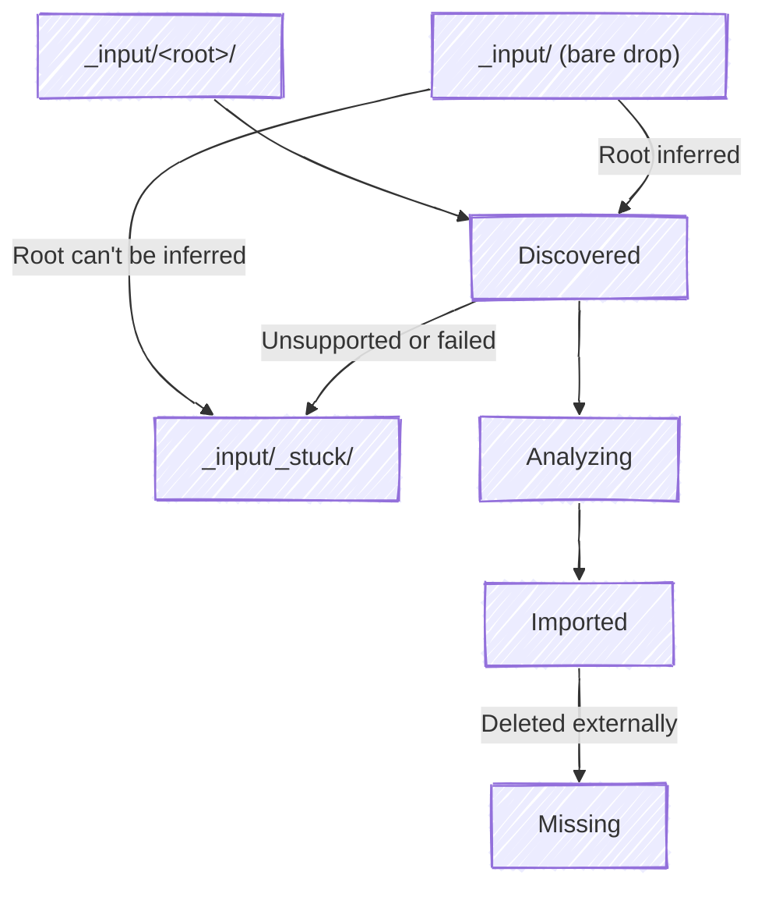

# The library

A library is one directory that holds everything Pinpoint manages: the `_input/` drop tree where files arrive, a `_stuck/` quarantine inside it, and the per-root output trees as siblings.

```text
<library>/
├── _input/
│   ├── _stuck/           # files Pinpoint can't place
│   ├── memory/           # drop photos and home video here
│   ├── music/            # drop audio here
│   ├── tv/
│   ├── movie/
│   ├── podcast/
│   ├── book/
│   └── comedy/
├── memories/             # output tree for root:memory
├── music/
├── movies/
├── tv/
├── podcast/
├── books/
└── comedy/
```

Pinpoint owns everything below the library root and scans nothing outside it. Moving a file from `_input/` to its derived path is an internal rearrangement, never an operation against a file you keep somewhere else.

## Getting files in is your step

A file becomes managed the moment it lands in `_input/`. How it got there — moved from another disk, copied, AirDropped, a download piped straight in — is your business.

From `_input/` onward, import always **moves**. There's no copy mode, because the source and destination are both inside the library.

## The lifecycle



**Discovered.** The watcher sees a new file. Before reading it, Pinpoint waits for a **quiet period** — no further filesystem events, and a stable size and mtime, for at least 2 seconds. That gives an in-progress copy time to finish.

**Analyzing.** The file stays where it is while Pinpoint hashes it, reads embedded metadata, parses the filename, and computes a confidence score from 0.0 to 1.0 based on where each tag came from.

**Imported.** Pinpoint derives the output path from the tags and moves the file there. There is no approval gate — a low-confidence file is imported and flagged for review rather than held back. Edit a path-relevant tag afterward and the file relocates, with empty parent directories cleaned up behind it.

## Where tags come from, and how much they're trusted

Confidence is weighted by source, so a tag read out of an ID3 frame outranks one a vision model guessed at.

| Source | Weight |
|---|---|
| Manual (you typed it) | 1.00 |
| Embedded metadata | 0.90 |
| Metadata API lookup | 0.85 |
| Filename parsing | 0.60 |
| Directory structure | 0.50 |
| AI analysis | 0.30 |
| Fallback | 0.10 |

## Bare drops

Drop a file at the root of `_input/` rather than into a root subdirectory and Pinpoint infers the root from what the file is:

| File | Inferred root |
|---|---|
| Image | `memory` |
| Audio | `music` |
| `.epub`, `.mobi`, `.azw`, `.azw3`, `.pdf` | `book` |
| Video with an `SxxExx` marker | `tv` |
| Video with a year | `movie` |

Anything left over goes to `_stuck/`.

## `_stuck/`

Three things land a file here: an unsupported file class, an import failure, or a bare drop whose root couldn't be inferred. The file keeps its path relative to `_input/`, so a file dropped at `_input/music/weird/thing.xyz` shows up at `_input/_stuck/music/weird/thing.xyz` with a reason recorded.

`_stuck/` is never re-scanned. Fix the cause, move the file back into a root subdirectory, and it gets another pass.

## Duplicates

Pinpoint hashes every file on discovery, so an exact duplicate is caught before it can be imported twice. Images additionally get a perceptual hash, which catches near-duplicates — the same photo resized, recompressed, or lightly edited.

When two genuinely different files derive the same output path, they're **stacked** with numeric suffixes (`-1`, `-2`) rather than one overwriting the other.
