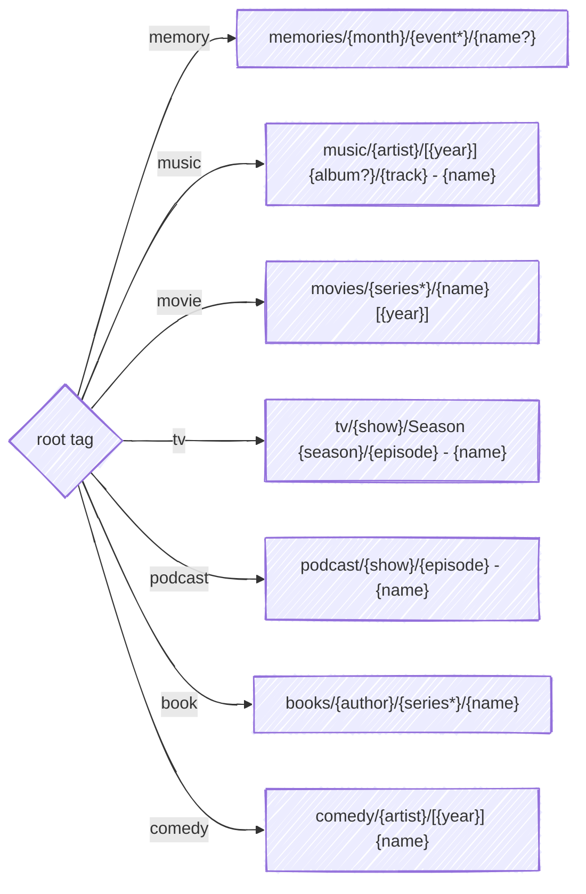

# Where files land

Given the same tags, Pinpoint always produces the same path. That determinism is the core contract — the directory tree is a projection of the tags, never state you maintain separately.

Each root has one fixed formula.



## Reading a formula

| Syntax | Meaning |
|---|---|
| `{tag:name}` | Required — `_unknown` if absent |
| `{tag:name?}` | Optional — the segment is dropped if absent |
| `{tag:name*}` | Nested — each `:` level becomes a directory |
| `[{tag:year}]` | Literal brackets around the value |

Literal text outside the braces is kept as written — the `Season ` prefix, the ` - ` separator. When an optional tag is absent, the separators and brackets around it go with it.

Two rules hold across every root:

- **`name:` replaces the filename.** Without it, the original filename is kept.
- **A missing required segment becomes `_unknown`** rather than collapsing the path.

## `memory`

Photos and home video, colocated, organized by date and event.

```text
memories/{tag:month}/{tag:event*}/{tag:name?}<ext>
```

| Tags | Path |
|---|---|
| (none) | `memories/2025-01/IMG_4521.jpg` |
| `event:Hawaii Vacation` | `memories/2025-01/Hawaii Vacation/IMG_4521.jpg` |
| `event:Hawaii Vacation:Snorkeling` | `memories/2025-01/Hawaii Vacation/Snorkeling/IMG_4521.jpg` |
| `event:Hawaii Vacation:Snorkeling`, `name:Sunset Over Ocean` | `memories/2025-01/Hawaii Vacation/Snorkeling/Sunset Over Ocean.jpg` |

## `music`

Songs, organized by artist. Albums carry their release year so the artist folder sorts chronologically.

```text
music/{tag:artist}/[{tag:year}] {tag:album?}/{tag:track} - {tag:name}<ext>
```

Track numbers are zero-padded to two digits so they sort as ordinals. With no track number, the name stands alone and the ` - ` separator is dropped.

| Tags | Path |
|---|---|
| `artist:Pink Floyd`, `album:Dark Side of the Moon`, `year:1973`, `track:1`, `name:Time` | `music/Pink Floyd/[1973] Dark Side of the Moon/01 - Time.flac` |
| `artist:Pink Floyd`, `name:Another Brick` | `music/Pink Floyd/Another Brick.mp3` |
| `artist:Jay-Z`, `feat:Alicia Keys`, `name:Empire State of Mind` | `music/Jay-Z/Empire State of Mind.mp3` |
| `name:Mystery Track` | `music/_unknown/Mystery Track.mp3` |

Which is what makes an artist folder browsable in Finder:

```text
[1967] The Piper at the Gates of Dawn/
[1973] Dark Side of the Moon/
[1975] Wish You Were Here/
[1979] The Wall/
```

## `movie`

Feature films, optionally grouped by franchise. The year disambiguates remakes.

```text
movies/{tag:series*}/{tag:name} [{tag:year}]<ext>
```

`series:` is optional — a standalone film sits flat in `movies/`.

| Tags | Path |
|---|---|
| `name:The Dark Knight`, `year:2008` | `movies/The Dark Knight [2008].mkv` |
| `series:Indiana Jones`, `name:Raiders of the Lost Ark`, `year:1981` | `movies/Indiana Jones/Raiders of the Lost Ark [1981].mkv` |
| (none) | `movies/movie.mkv` |

## `tv`

Episodes, organized by show and season. Season and episode numbers are zero-padded to two digits.

```text
tv/{tag:show}/Season {tag:season}/{tag:episode} - {tag:name}<ext>
```

| Tags | Path |
|---|---|
| `show:The Office`, `season:3`, `episode:5`, `name:The Merger` | `tv/The Office/Season 03/05 - The Merger.mkv` |
| `show:The Office`, `season:3`, `episode:5` | `tv/The Office/Season 03/05.mkv` |
| `show:The Office` | `tv/The Office/episode.mkv` |

## `podcast`

Episodes, organized by show.

```text
podcast/{tag:show}/{tag:episode} - {tag:name}<ext>
```

| Tags | Path |
|---|---|
| `show:Hardcore History`, `episode:66`, `name:Supernova in the East` | `podcast/Hardcore History/66 - Supernova in the East.mp3` |
| `show:Hardcore History` | `podcast/Hardcore History/episode.mp3` |
| (none) | `podcast/_unknown/episode.mp3` |

## `book`

Organized by author, optionally grouped by series.

```text
books/{tag:author}/{tag:series*}/{tag:name}<ext>
```

| Tags | Path |
|---|---|
| `author:Tolkien`, `name:The Hobbit` | `books/Tolkien/The Hobbit.m4a` |
| `author:Tolkien`, `series:Middle Earth`, `name:The Hobbit` | `books/Tolkien/Middle Earth/The Hobbit.m4a` |
| (none) | `books/_unknown/book.m4a` |

## `comedy`

Standup and sketches, organized by performer. Year leads the filename so a performer's folder reads chronologically.

```text
comedy/{tag:artist}/[{tag:year}] {tag:name}<ext>
```

| Tags | Path |
|---|---|
| `artist:John Mulaney`, `name:Kid Gorgeous`, `year:2018` | `comedy/John Mulaney/[2018] Kid Gorgeous.mp4` |
| `artist:John Mulaney` | `comedy/John Mulaney/special.mp4` |

## Collisions

When two different files derive the same path, they're stacked with numeric suffixes — `The Merger.mkv`, `The Merger-1.mkv` — rather than one overwriting the other.

## Changing a tag moves the file

Edit a path-relevant tag on an imported file and Pinpoint recomputes the path, moves the file, and removes any parent directory the move left empty. Every relocation is recorded in the action log.

The full set of rules and edge cases, each with its implementation status, is in [SPEC §3](/spec?id=_3-output-path-structure).
