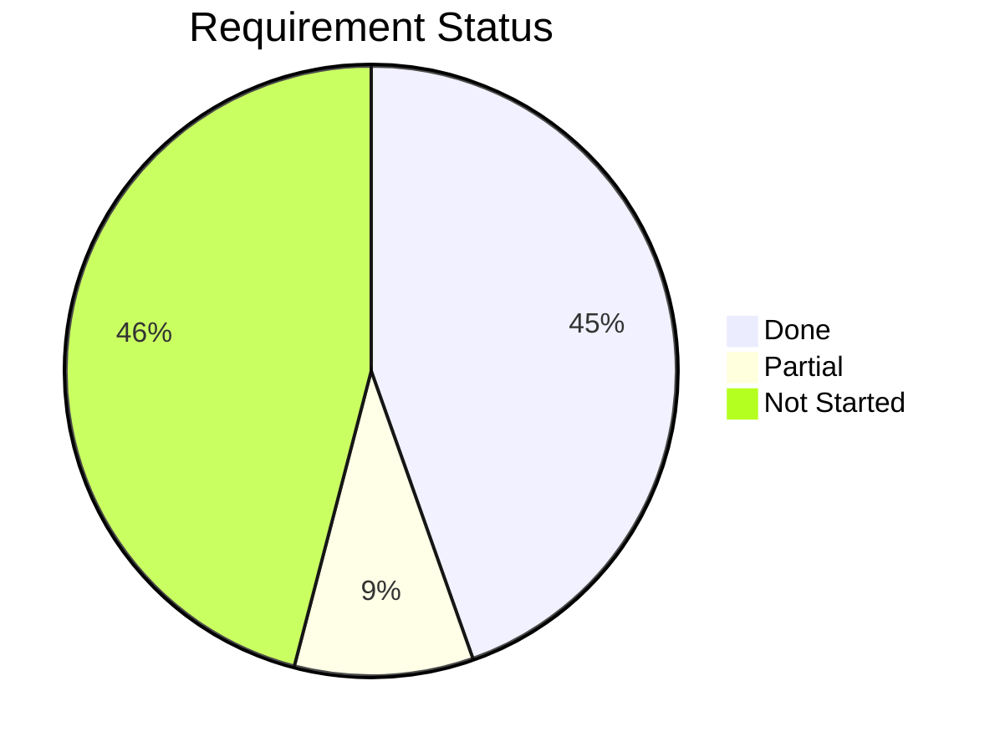

# STATUS.md — Requirements Traceability Matrix (Implementation 1: Python)

Maps SPEC.md requirement IDs to implementation status and code locations.

## Legend

- **Done** — implemented and tested
- **Partial** — some aspects implemented, gaps noted
- **N/S** — not started

---

## §1 Core Model

| ID | Requirement | Status | Code |
|---|---|---|---|
| [CM-1] | Input folders with default root | Done | `config.py`, `discovery.py` |
| [CM-2] | Single output directory, path from tags | Done | `config.py`, `paths.py` |
| [CM-3] | Pending: known, original untouched | Done | `discovery.py` |
| [CM-4] | Managed: accepted, moved to output | Done | `api/queue.py:accept_file` |
| [CM-5] | Files are source of truth (tags in native metadata) | N/S | |

## §2 Tag Taxonomy

| ID | Requirement | Status | Code |
|---|---|---|---|
| [TX-1] | `type:value` tag structure | Done | `schema.sql`, `models.py` |
| [TX-2] | Root override per-file in queue | N/S | |
| [TX-3] | `class` derived from extension (not a tag) | Done | `discovery.py:classify_file` |
| [TX-4] | `name:` replaces filename | Done | `paths.py:_get_name` |
| [TX-5] | `favorite` column for fast sorting | Partial | Schema exists, no UI toggle |
| [TX-6] | Tag dictionary / autocomplete | Partial | Endpoint exists, no tree view |

## §3 Output Path Structure

| ID | Requirement | Status | Code |
|---|---|---|---|
| [OP-1] | Deterministic path from tags | Done | `paths.py:derive_path` — 38 tests |
| [OP-2] | Memories date from metadata > filesystem | Partial | EXIF for images, not QuickTime |
| [OP-3] | Music track number zero-padded in filename | Done | `paths.py:_derive_music`, `defaults.py:extract_audio_metadata` |
| [OP-4] | VA compilations preserve original filename | Done | `defaults.py:_defaults_music`, `paths.py:_derive_music` |
| [OP-5] | Title Case tag values | Done | `defaults.py:slugify`, `defaults.py:title_case` — 12 tests |
| [OP-6] | Year auto-prepended to album | Done | `paths.py:_derive_music` |
| [OP-7] | `name:` replaces filename, absent keeps original | Done | `paths.py:_get_name` |
| [OP-8] | `_unknown` for missing path segments | Done | `paths.py:_first_or` |
| [OP-9] | Collision suffixes (`-1`, `-2`) | Done | `api/queue.py:_resolve_collision` |
| [OP-10] | Stack dissolve removes suffix | N/S | |
| [OP-11] | Tag change triggers relocation | N/S | |

## §4 Migration Queue

| ID | Requirement | Status | Code |
|---|---|---|---|
| [MQ-1] | One file at a time, newest first | Done | `web/routes.py:queue_page` |
| [MQ-2] | Full-size preview | Done | `templates/queue.html`, `api/files.py` |
| [MQ-3] | File metadata display | Done | `templates/queue.html .file-info` |
| [MQ-4] | Live path preview via HTMX | Done | `api/tags.py:preview_path` |
| [MQ-5] | Queue count badge | Partial | Count on page, no sidebar |
| [MQ-6] | Batch table/list view | N/S | |
| [MQ-7] | Accept all (stable metadata) | Done | `api/queue.py:accept_folder`, `templates/queue.html` |
| [MQ-8] | Editable rows before batch accept | N/S | |
| [MQ-9] | Click row for single-file detail | N/S | |

## §5 Dedup & Stacking

| ID | Requirement | Status | Code |
|---|---|---|---|
| [DS-1] | Content hash dedup at discovery | Done | `discovery.py:hash_file` |
| [DS-2] | Perceptual hash auto-stack | N/S | |

## §6 AI Analysis

| ID | Requirement | Status | Code |
|---|---|---|---|
| [AI-1] | Read embedded audio tags | Done | `defaults.py:extract_audio_metadata` |
| [AI-2] | Extract title, artist, album, year, track | Done | `defaults.py:extract_audio_metadata` |
| [AI-3] | Skip album art images during discovery | Done | `discovery.py:_walk_files` |

## §7 Search & Browsing (Home Page)

| ID | Requirement | Status | Code |
|---|---|---|---|
| [LB-1] | Full-text search bar on home page | N/S | FTS5 in schema, not wired |
| [LB-2] | Results as folder cards + individual files | N/S | |
| [LB-3] | Filters (root, class, date, person/artist, tags) | Partial | Root + class filters on queue |
| [LB-4] | Folders as primary browsing unit (hero image + name) | N/S | |
| [LB-5] | Hero image (first image or stack cover) | N/S | |
| [LB-6] | Ungrouped files shown alongside folders | N/S | |
| [LB-7] | Folder detail view with contextual file icons | Partial | Tree view exists in `templates/library.html` |
| [LB-8] | On This Day | N/S | |
| [LB-9] | Tag dictionary browser | N/S | |

## §8 Favorites

| ID | Requirement | Status | Code |
|---|---|---|---|
| [FV-1] | Boolean column for fast sorting | Done | `schema.sql` |
| [FV-2] | Star toggle in UI | N/S | |

## §9 File Detail

| ID | Requirement | Status | Code |
|---|---|---|---|
| [FD-1] | Full-size preview overlay | N/S | |
| [FD-2] | Editable tags sidebar | N/S | |

## §10 Data Model

| ID | Requirement | Status | Code |
|---|---|---|---|
| [DM-1] | Append-only action log | Done | `actions.py:log_action`, all 17 verbs in `models.py` |
| [DM-2] | files, tags, file_tags tables | Done | `schema.sql`, `database.py` |
| [DM-3] | suggestions, stacks, known_faces | Done | Schema only, no logic |

## §11 Output Monitoring

| ID | Requirement | Status | Code |
|---|---|---|---|
| [OM-1] | Detect rename via watcher | N/S | |
| [OM-2] | Update managed_path on rename | N/S | |
| [OM-3] | Log rename action | N/S | |
| [OM-4] | Tags remain source of truth (no reverse-derive) | N/S | |
| [OM-5] | Detect external delete | N/S | |
| [OM-6] | Mark file as missing (not deleted) | N/S | |
| [OM-7] | Log missing action | N/S | |

## §12 Tag Persistence

| ID | Requirement | Status | Code |
|---|---|---|---|
| [TP-1] | Write tags to native metadata fields | N/S | |
| [TP-2] | Format-agnostic tags via xattr | N/S | |
| [TP-3] | Path-derivable tags not written | Done | `api/queue.py:DERIVED_ATTRIBUTES` |
| [TP-4] | Write metadata on accept | N/S | |
| [TP-5] | Rewrite metadata on tag change | N/S | |
| [TP-6] | Mirror to macOS Finder tags | N/S | |
| [TP-7] | Import Finder tags on discovery | N/S | |
| [TP-8] | Linux xattr namespace | N/S | |
| [TP-9] | `pinpoint rebuild` from managed files | N/S | |
| [TP-10] | Action history not recoverable | Done | `actions.py` (append-only) |
| [TP-11] | Rebuild cross-checks path vs tags | N/S | |

## §13 Configuration

| ID | Requirement | Status | Code |
|---|---|---|---|
| [CF-1] | YAML config with inputs + output | Done | `config.py:load_config` |
| [CF-2] | Default data dir `~/.pinpoint/` | Done | `config.py` |
| [CF-3] | `--config` CLI flag | Done | `__main__.py` |
| [CF-4] | Hot-reload on file change | Partial | `ConfigHolder` exists, watcher not connected |

---

## Summary

| Section | Done | Partial | N/S |
|---|---|---|---|
| §1 Core Model | 4 | 0 | 1 |
| §2 Tag Taxonomy | 3 | 2 | 1 |
| §3 Output Path | 8 | 1 | 2 |
| §4 Queue | 5 | 1 | 3 |
| §5 Dedup | 1 | 0 | 1 |
| §6 AI Analysis | 3 | 0 | 0 |
| §7 Search & Browse | 0 | 2 | 7 |
| §8 Favorites | 1 | 0 | 1 |
| §9 File Detail | 0 | 0 | 2 |
| §10 Data Model | 3 | 0 | 0 |
| §11 Monitoring | 0 | 0 | 7 |
| §12 Tag Persistence | 2 | 0 | 9 |
| §13 Configuration | 3 | 1 | 0 |
| **Total** | **33** | **7** | **34** |

